# Costa Rican Household Poverty Level Prediction

## 1. Problem and Data Explanation

- train set : 9557개의 행과 143개의 열로 이루어진 데이터
- validation set : 23856개의 행과 142개의 열로 이루어진 데이터
- 각 행은 한 개인을 나타내고 각 열은 개별 또는 개인의 가정에 고유한 특성을 나타낸다

타겟 값들은 다음과 같이 빈곤수준을 나타낸다


```python
1 = extreme poverty 
2 = moderate poverty 
3 = vulnerable households 
4 = non vulnerable households
```

## - Objective

가정 차원의 빈곤을 예측하는 것

주의사항: 가구의 모든 구성원은 교육 데이터에 동일한 라벨을 가지고 있어야 하지만, 동일한 가구임에도 개인별로 다른 라벨을 가지고 있는 오류가 있다. 이러한 경우 각 가정의 가장에 대한 라벨을 사용해야 하며, 이는 `parentesco1 == 1.0` 행으로 식별할 수 있다.

특성별 몇가지 유의사항
- `Id` : 각 개인의 고유 식별자. 수정하면 안 됨!
- `idhogar` : 각 가정에 고유한 식별자. 이 변수는 특징이 아니지만, 가구의 모든 개인이 동일한 식별자를 가지므로 가구별로 개인을 그룹화하는 데 사용
- `parentesco1` : 이 사람이 가장인지 여부를 나타냄
- `Target` : 라벨. 한 가정의 모든 구성원은 동일한 값을 가져야 함

- 우리가 모델을 만들 때, 우리는 각 가정에 가장의 빈곤수준이라는 라벨을 붙이고 가정 단위로 학습시킬 것
- 원시 데이터는 가정과 개인의 특성을 모두 포함하고 있으며 개별 데이터의 경우 각 가정에 대해 이를 집계하는 방법을 찾아야 한다
- 일부 개인들은 가장이 없는 가정에 속하는데, 이러한 데이터는 훈련에 사용할 수 없다


## - Metric

다중 클래스 문제의 경우 각 클래스의 F1 점수를 평균을 구한 값으로 평가를 한다.\
매크로 F1 점수는 레이블 불균형을 고려하지 않고 각 클래스의 F1 점수를 가지고 평균을 구함.


```python
from sklearn.metrics import f1_score
f1_score(y_true, y_predicted, average = 'macro`)
```

이 문제의 경우 레이블이 불균형하기 때문에 평가 메트릭으로 매크로 평균을 사용하는 것이 약간 이상하지만, 이는 주최자가 결정한 결정이지 변경할 수 있는 것은 아니다.

# 2. Getting Started

## - EDA

**Import**


```python
# Data manipulation
import pandas as pd
import numpy as np

# Visualization
import matplotlib.pyplot as plt
import seaborn as sns

# Set a few plotting defaults
%matplotlib inline
plt.style.use('fivethirtyeight')
plt.rcParams['font.size'] = 18
plt.rcParams['patch.edgecolor'] = 'k'
```

**Read in Data and Look at Summary Information**


```python
pd.options.display.max_columns = 150

#데이터 불러오기
train = pd.read_csv('https://url.kr/fyji4n')
test = pd.read_csv('https://url.kr/zm96op')
train.head()
```


<div>
<style scoped>
    .dataframe tbody tr th:only-of-type {
        vertical-align: middle;
    }

    .dataframe tbody tr th {
        vertical-align: top;
    }

    .dataframe thead th {
        text-align: right;
    }
</style>
<table border="1" class="dataframe">
  <thead>
    <tr style="text-align: right;">
      <th></th>
      <th>Id</th>
      <th>v2a1</th>
      <th>hacdor</th>
      <th>rooms</th>
      <th>hacapo</th>
      <th>v14a</th>
      <th>refrig</th>
      <th>v18q</th>
      <th>v18q1</th>
      <th>r4h1</th>
      <th>r4h2</th>
      <th>r4h3</th>
      <th>r4m1</th>
      <th>r4m2</th>
      <th>r4m3</th>
      <th>r4t1</th>
      <th>r4t2</th>
      <th>r4t3</th>
      <th>tamhog</th>
      <th>tamviv</th>
      <th>escolari</th>
      <th>rez_esc</th>
      <th>hhsize</th>
      <th>paredblolad</th>
      <th>paredzocalo</th>
      <th>paredpreb</th>
      <th>pareddes</th>
      <th>paredmad</th>
      <th>paredzinc</th>
      <th>paredfibras</th>
      <th>paredother</th>
      <th>pisomoscer</th>
      <th>pisocemento</th>
      <th>pisoother</th>
      <th>pisonatur</th>
      <th>pisonotiene</th>
      <th>pisomadera</th>
      <th>techozinc</th>
      <th>techoentrepiso</th>
      <th>techocane</th>
      <th>techootro</th>
      <th>cielorazo</th>
      <th>abastaguadentro</th>
      <th>abastaguafuera</th>
      <th>abastaguano</th>
      <th>public</th>
      <th>planpri</th>
      <th>noelec</th>
      <th>coopele</th>
      <th>sanitario1</th>
      <th>sanitario2</th>
      <th>sanitario3</th>
      <th>sanitario5</th>
      <th>sanitario6</th>
      <th>energcocinar1</th>
      <th>energcocinar2</th>
      <th>energcocinar3</th>
      <th>energcocinar4</th>
      <th>elimbasu1</th>
      <th>elimbasu2</th>
      <th>elimbasu3</th>
      <th>elimbasu4</th>
      <th>elimbasu5</th>
      <th>elimbasu6</th>
      <th>epared1</th>
      <th>epared2</th>
      <th>epared3</th>
      <th>etecho1</th>
      <th>etecho2</th>
      <th>etecho3</th>
      <th>eviv1</th>
      <th>eviv2</th>
      <th>eviv3</th>
      <th>dis</th>
      <th>male</th>
      <th>female</th>
      <th>estadocivil1</th>
      <th>estadocivil2</th>
      <th>estadocivil3</th>
      <th>estadocivil4</th>
      <th>estadocivil5</th>
      <th>estadocivil6</th>
      <th>estadocivil7</th>
      <th>parentesco1</th>
      <th>parentesco2</th>
      <th>parentesco3</th>
      <th>parentesco4</th>
      <th>parentesco5</th>
      <th>parentesco6</th>
      <th>parentesco7</th>
      <th>parentesco8</th>
      <th>parentesco9</th>
      <th>parentesco10</th>
      <th>parentesco11</th>
      <th>parentesco12</th>
      <th>idhogar</th>
      <th>hogar_nin</th>
      <th>hogar_adul</th>
      <th>hogar_mayor</th>
      <th>hogar_total</th>
      <th>dependency</th>
      <th>edjefe</th>
      <th>edjefa</th>
      <th>meaneduc</th>
      <th>instlevel1</th>
      <th>instlevel2</th>
      <th>instlevel3</th>
      <th>instlevel4</th>
      <th>instlevel5</th>
      <th>instlevel6</th>
      <th>instlevel7</th>
      <th>instlevel8</th>
      <th>instlevel9</th>
      <th>bedrooms</th>
      <th>overcrowding</th>
      <th>tipovivi1</th>
      <th>tipovivi2</th>
      <th>tipovivi3</th>
      <th>tipovivi4</th>
      <th>tipovivi5</th>
      <th>computer</th>
      <th>television</th>
      <th>mobilephone</th>
      <th>qmobilephone</th>
      <th>lugar1</th>
      <th>lugar2</th>
      <th>lugar3</th>
      <th>lugar4</th>
      <th>lugar5</th>
      <th>lugar6</th>
      <th>area1</th>
      <th>area2</th>
      <th>age</th>
      <th>SQBescolari</th>
      <th>SQBage</th>
      <th>SQBhogar_total</th>
      <th>SQBedjefe</th>
      <th>SQBhogar_nin</th>
      <th>SQBovercrowding</th>
      <th>SQBdependency</th>
      <th>SQBmeaned</th>
      <th>agesq</th>
      <th>Target</th>
    </tr>
  </thead>
  <tbody>
    <tr>
      <th>0</th>
      <td>ID_279628684</td>
      <td>190000.0</td>
      <td>0</td>
      <td>3</td>
      <td>0</td>
      <td>1</td>
      <td>1</td>
      <td>0</td>
      <td>NaN</td>
      <td>0</td>
      <td>1</td>
      <td>1</td>
      <td>0</td>
      <td>0</td>
      <td>0</td>
      <td>0</td>
      <td>1</td>
      <td>1</td>
      <td>1</td>
      <td>1</td>
      <td>10</td>
      <td>NaN</td>
      <td>1</td>
      <td>1</td>
      <td>0</td>
      <td>0</td>
      <td>0</td>
      <td>0</td>
      <td>0</td>
      <td>0</td>
      <td>0</td>
      <td>1</td>
      <td>0</td>
      <td>0</td>
      <td>0</td>
      <td>0</td>
      <td>0</td>
      <td>0</td>
      <td>1</td>
      <td>0</td>
      <td>0</td>
      <td>1</td>
      <td>1</td>
      <td>0</td>
      <td>0</td>
      <td>1</td>
      <td>0</td>
      <td>0</td>
      <td>0</td>
      <td>0</td>
      <td>1</td>
      <td>0</td>
      <td>0</td>
      <td>0</td>
      <td>0</td>
      <td>0</td>
      <td>1</td>
      <td>0</td>
      <td>1</td>
      <td>0</td>
      <td>0</td>
      <td>0</td>
      <td>0</td>
      <td>0</td>
      <td>0</td>
      <td>1</td>
      <td>0</td>
      <td>1</td>
      <td>0</td>
      <td>0</td>
      <td>1</td>
      <td>0</td>
      <td>0</td>
      <td>0</td>
      <td>1</td>
      <td>0</td>
      <td>0</td>
      <td>0</td>
      <td>0</td>
      <td>1</td>
      <td>0</td>
      <td>0</td>
      <td>0</td>
      <td>1</td>
      <td>0</td>
      <td>0</td>
      <td>0</td>
      <td>0</td>
      <td>0</td>
      <td>0</td>
      <td>0</td>
      <td>0</td>
      <td>0</td>
      <td>0</td>
      <td>0</td>
      <td>21eb7fcc1</td>
      <td>0</td>
      <td>1</td>
      <td>0</td>
      <td>1</td>
      <td>no</td>
      <td>10</td>
      <td>no</td>
      <td>10.0</td>
      <td>0</td>
      <td>0</td>
      <td>0</td>
      <td>1</td>
      <td>0</td>
      <td>0</td>
      <td>0</td>
      <td>0</td>
      <td>0</td>
      <td>1</td>
      <td>1.000000</td>
      <td>0</td>
      <td>0</td>
      <td>1</td>
      <td>0</td>
      <td>0</td>
      <td>0</td>
      <td>0</td>
      <td>1</td>
      <td>1</td>
      <td>1</td>
      <td>0</td>
      <td>0</td>
      <td>0</td>
      <td>0</td>
      <td>0</td>
      <td>1</td>
      <td>0</td>
      <td>43</td>
      <td>100</td>
      <td>1849</td>
      <td>1</td>
      <td>100</td>
      <td>0</td>
      <td>1.000000</td>
      <td>0.0</td>
      <td>100.0</td>
      <td>1849</td>
      <td>4</td>
    </tr>
    <tr>
      <th>1</th>
      <td>ID_f29eb3ddd</td>
      <td>135000.0</td>
      <td>0</td>
      <td>4</td>
      <td>0</td>
      <td>1</td>
      <td>1</td>
      <td>1</td>
      <td>1.0</td>
      <td>0</td>
      <td>1</td>
      <td>1</td>
      <td>0</td>
      <td>0</td>
      <td>0</td>
      <td>0</td>
      <td>1</td>
      <td>1</td>
      <td>1</td>
      <td>1</td>
      <td>12</td>
      <td>NaN</td>
      <td>1</td>
      <td>0</td>
      <td>0</td>
      <td>0</td>
      <td>0</td>
      <td>1</td>
      <td>0</td>
      <td>0</td>
      <td>0</td>
      <td>0</td>
      <td>0</td>
      <td>0</td>
      <td>0</td>
      <td>0</td>
      <td>1</td>
      <td>1</td>
      <td>0</td>
      <td>0</td>
      <td>0</td>
      <td>1</td>
      <td>1</td>
      <td>0</td>
      <td>0</td>
      <td>1</td>
      <td>0</td>
      <td>0</td>
      <td>0</td>
      <td>0</td>
      <td>1</td>
      <td>0</td>
      <td>0</td>
      <td>0</td>
      <td>0</td>
      <td>1</td>
      <td>0</td>
      <td>0</td>
      <td>1</td>
      <td>0</td>
      <td>0</td>
      <td>0</td>
      <td>0</td>
      <td>0</td>
      <td>0</td>
      <td>1</td>
      <td>0</td>
      <td>0</td>
      <td>1</td>
      <td>0</td>
      <td>0</td>
      <td>1</td>
      <td>0</td>
      <td>0</td>
      <td>1</td>
      <td>0</td>
      <td>0</td>
      <td>0</td>
      <td>0</td>
      <td>1</td>
      <td>0</td>
      <td>0</td>
      <td>0</td>
      <td>1</td>
      <td>0</td>
      <td>0</td>
      <td>0</td>
      <td>0</td>
      <td>0</td>
      <td>0</td>
      <td>0</td>
      <td>0</td>
      <td>0</td>
      <td>0</td>
      <td>0</td>
      <td>0e5d7a658</td>
      <td>0</td>
      <td>1</td>
      <td>1</td>
      <td>1</td>
      <td>8</td>
      <td>12</td>
      <td>no</td>
      <td>12.0</td>
      <td>0</td>
      <td>0</td>
      <td>0</td>
      <td>0</td>
      <td>0</td>
      <td>0</td>
      <td>0</td>
      <td>1</td>
      <td>0</td>
      <td>1</td>
      <td>1.000000</td>
      <td>0</td>
      <td>0</td>
      <td>1</td>
      <td>0</td>
      <td>0</td>
      <td>0</td>
      <td>0</td>
      <td>1</td>
      <td>1</td>
      <td>1</td>
      <td>0</td>
      <td>0</td>
      <td>0</td>
      <td>0</td>
      <td>0</td>
      <td>1</td>
      <td>0</td>
      <td>67</td>
      <td>144</td>
      <td>4489</td>
      <td>1</td>
      <td>144</td>
      <td>0</td>
      <td>1.000000</td>
      <td>64.0</td>
      <td>144.0</td>
      <td>4489</td>
      <td>4</td>
    </tr>
    <tr>
      <th>2</th>
      <td>ID_68de51c94</td>
      <td>NaN</td>
      <td>0</td>
      <td>8</td>
      <td>0</td>
      <td>1</td>
      <td>1</td>
      <td>0</td>
      <td>NaN</td>
      <td>0</td>
      <td>0</td>
      <td>0</td>
      <td>0</td>
      <td>1</td>
      <td>1</td>
      <td>0</td>
      <td>1</td>
      <td>1</td>
      <td>1</td>
      <td>1</td>
      <td>11</td>
      <td>NaN</td>
      <td>1</td>
      <td>0</td>
      <td>0</td>
      <td>0</td>
      <td>0</td>
      <td>1</td>
      <td>0</td>
      <td>0</td>
      <td>0</td>
      <td>1</td>
      <td>0</td>
      <td>0</td>
      <td>0</td>
      <td>0</td>
      <td>0</td>
      <td>1</td>
      <td>0</td>
      <td>0</td>
      <td>0</td>
      <td>1</td>
      <td>1</td>
      <td>0</td>
      <td>0</td>
      <td>1</td>
      <td>0</td>
      <td>0</td>
      <td>0</td>
      <td>0</td>
      <td>1</td>
      <td>0</td>
      <td>0</td>
      <td>0</td>
      <td>0</td>
      <td>1</td>
      <td>0</td>
      <td>0</td>
      <td>1</td>
      <td>0</td>
      <td>0</td>
      <td>0</td>
      <td>0</td>
      <td>0</td>
      <td>0</td>
      <td>1</td>
      <td>0</td>
      <td>0</td>
      <td>0</td>
      <td>1</td>
      <td>0</td>
      <td>0</td>
      <td>1</td>
      <td>1</td>
      <td>0</td>
      <td>1</td>
      <td>0</td>
      <td>0</td>
      <td>0</td>
      <td>0</td>
      <td>0</td>
      <td>1</td>
      <td>0</td>
      <td>1</td>
      <td>0</td>
      <td>0</td>
      <td>0</td>
      <td>0</td>
      <td>0</td>
      <td>0</td>
      <td>0</td>
      <td>0</td>
      <td>0</td>
      <td>0</td>
      <td>0</td>
      <td>2c7317ea8</td>
      <td>0</td>
      <td>1</td>
      <td>1</td>
      <td>1</td>
      <td>8</td>
      <td>no</td>
      <td>11</td>
      <td>11.0</td>
      <td>0</td>
      <td>0</td>
      <td>0</td>
      <td>0</td>
      <td>1</td>
      <td>0</td>
      <td>0</td>
      <td>0</td>
      <td>0</td>
      <td>2</td>
      <td>0.500000</td>
      <td>1</td>
      <td>0</td>
      <td>0</td>
      <td>0</td>
      <td>0</td>
      <td>0</td>
      <td>0</td>
      <td>0</td>
      <td>0</td>
      <td>1</td>
      <td>0</td>
      <td>0</td>
      <td>0</td>
      <td>0</td>
      <td>0</td>
      <td>1</td>
      <td>0</td>
      <td>92</td>
      <td>121</td>
      <td>8464</td>
      <td>1</td>
      <td>0</td>
      <td>0</td>
      <td>0.250000</td>
      <td>64.0</td>
      <td>121.0</td>
      <td>8464</td>
      <td>4</td>
    </tr>
    <tr>
      <th>3</th>
      <td>ID_d671db89c</td>
      <td>180000.0</td>
      <td>0</td>
      <td>5</td>
      <td>0</td>
      <td>1</td>
      <td>1</td>
      <td>1</td>
      <td>1.0</td>
      <td>0</td>
      <td>2</td>
      <td>2</td>
      <td>1</td>
      <td>1</td>
      <td>2</td>
      <td>1</td>
      <td>3</td>
      <td>4</td>
      <td>4</td>
      <td>4</td>
      <td>9</td>
      <td>1.0</td>
      <td>4</td>
      <td>1</td>
      <td>0</td>
      <td>0</td>
      <td>0</td>
      <td>0</td>
      <td>0</td>
      <td>0</td>
      <td>0</td>
      <td>1</td>
      <td>0</td>
      <td>0</td>
      <td>0</td>
      <td>0</td>
      <td>0</td>
      <td>1</td>
      <td>0</td>
      <td>0</td>
      <td>0</td>
      <td>1</td>
      <td>1</td>
      <td>0</td>
      <td>0</td>
      <td>1</td>
      <td>0</td>
      <td>0</td>
      <td>0</td>
      <td>0</td>
      <td>1</td>
      <td>0</td>
      <td>0</td>
      <td>0</td>
      <td>0</td>
      <td>1</td>
      <td>0</td>
      <td>0</td>
      <td>1</td>
      <td>0</td>
      <td>0</td>
      <td>0</td>
      <td>0</td>
      <td>0</td>
      <td>0</td>
      <td>0</td>
      <td>1</td>
      <td>0</td>
      <td>0</td>
      <td>1</td>
      <td>0</td>
      <td>0</td>
      <td>1</td>
      <td>0</td>
      <td>1</td>
      <td>0</td>
      <td>0</td>
      <td>0</td>
      <td>0</td>
      <td>0</td>
      <td>0</td>
      <td>0</td>
      <td>1</td>
      <td>0</td>
      <td>0</td>
      <td>1</td>
      <td>0</td>
      <td>0</td>
      <td>0</td>
      <td>0</td>
      <td>0</td>
      <td>0</td>
      <td>0</td>
      <td>0</td>
      <td>0</td>
      <td>2b58d945f</td>
      <td>2</td>
      <td>2</td>
      <td>0</td>
      <td>4</td>
      <td>yes</td>
      <td>11</td>
      <td>no</td>
      <td>11.0</td>
      <td>0</td>
      <td>0</td>
      <td>0</td>
      <td>1</td>
      <td>0</td>
      <td>0</td>
      <td>0</td>
      <td>0</td>
      <td>0</td>
      <td>3</td>
      <td>1.333333</td>
      <td>0</td>
      <td>0</td>
      <td>1</td>
      <td>0</td>
      <td>0</td>
      <td>0</td>
      <td>0</td>
      <td>1</td>
      <td>3</td>
      <td>1</td>
      <td>0</td>
      <td>0</td>
      <td>0</td>
      <td>0</td>
      <td>0</td>
      <td>1</td>
      <td>0</td>
      <td>17</td>
      <td>81</td>
      <td>289</td>
      <td>16</td>
      <td>121</td>
      <td>4</td>
      <td>1.777778</td>
      <td>1.0</td>
      <td>121.0</td>
      <td>289</td>
      <td>4</td>
    </tr>
    <tr>
      <th>4</th>
      <td>ID_d56d6f5f5</td>
      <td>180000.0</td>
      <td>0</td>
      <td>5</td>
      <td>0</td>
      <td>1</td>
      <td>1</td>
      <td>1</td>
      <td>1.0</td>
      <td>0</td>
      <td>2</td>
      <td>2</td>
      <td>1</td>
      <td>1</td>
      <td>2</td>
      <td>1</td>
      <td>3</td>
      <td>4</td>
      <td>4</td>
      <td>4</td>
      <td>11</td>
      <td>NaN</td>
      <td>4</td>
      <td>1</td>
      <td>0</td>
      <td>0</td>
      <td>0</td>
      <td>0</td>
      <td>0</td>
      <td>0</td>
      <td>0</td>
      <td>1</td>
      <td>0</td>
      <td>0</td>
      <td>0</td>
      <td>0</td>
      <td>0</td>
      <td>1</td>
      <td>0</td>
      <td>0</td>
      <td>0</td>
      <td>1</td>
      <td>1</td>
      <td>0</td>
      <td>0</td>
      <td>1</td>
      <td>0</td>
      <td>0</td>
      <td>0</td>
      <td>0</td>
      <td>1</td>
      <td>0</td>
      <td>0</td>
      <td>0</td>
      <td>0</td>
      <td>1</td>
      <td>0</td>
      <td>0</td>
      <td>1</td>
      <td>0</td>
      <td>0</td>
      <td>0</td>
      <td>0</td>
      <td>0</td>
      <td>0</td>
      <td>0</td>
      <td>1</td>
      <td>0</td>
      <td>0</td>
      <td>1</td>
      <td>0</td>
      <td>0</td>
      <td>1</td>
      <td>0</td>
      <td>0</td>
      <td>1</td>
      <td>0</td>
      <td>1</td>
      <td>0</td>
      <td>0</td>
      <td>0</td>
      <td>0</td>
      <td>0</td>
      <td>0</td>
      <td>1</td>
      <td>0</td>
      <td>0</td>
      <td>0</td>
      <td>0</td>
      <td>0</td>
      <td>0</td>
      <td>0</td>
      <td>0</td>
      <td>0</td>
      <td>0</td>
      <td>2b58d945f</td>
      <td>2</td>
      <td>2</td>
      <td>0</td>
      <td>4</td>
      <td>yes</td>
      <td>11</td>
      <td>no</td>
      <td>11.0</td>
      <td>0</td>
      <td>0</td>
      <td>0</td>
      <td>0</td>
      <td>1</td>
      <td>0</td>
      <td>0</td>
      <td>0</td>
      <td>0</td>
      <td>3</td>
      <td>1.333333</td>
      <td>0</td>
      <td>0</td>
      <td>1</td>
      <td>0</td>
      <td>0</td>
      <td>0</td>
      <td>0</td>
      <td>1</td>
      <td>3</td>
      <td>1</td>
      <td>0</td>
      <td>0</td>
      <td>0</td>
      <td>0</td>
      <td>0</td>
      <td>1</td>
      <td>0</td>
      <td>37</td>
      <td>121</td>
      <td>1369</td>
      <td>16</td>
      <td>121</td>
      <td>4</td>
      <td>1.777778</td>
      <td>1.0</td>
      <td>121.0</td>
      <td>1369</td>
      <td>4</td>
    </tr>
  </tbody>
</table>
</div>


```python
#전체적인 데이터 살펴보기
train.info() 
```

    <class 'pandas.core.frame.DataFrame'>
    RangeIndex: 9557 entries, 0 to 9556
    Columns: 143 entries, Id to Target
    dtypes: float64(8), int64(130), object(5)
    memory usage: 10.4+ MB


- 130개의 정수 열, 8개의 부동(숫자) 열 및 5개의 객체 열이 있다
- integer column은 부울 변수(0 또는 1) 또는 이산 순서 값을 갖는 순서형 변수를 나타낸다
- object column은 기계 학습 모델에 직접 학습시킬 수 없기 때문에 문제가 될 수 있다


```python
#테스트 데이터 확인
test.info()
```

    <class 'pandas.core.frame.DataFrame'>
    RangeIndex: 23856 entries, 0 to 23855
    Columns: 142 entries, Id to agesq
    dtypes: float64(8), int64(129), object(5)
    memory usage: 25.8+ MB


```python
#정수 열의 고유 값 분포 확인
##각 열에 대해 고유 값의 수를 세고 barplot으로 시각화
train.select_dtypes(np.int64).nunique().value_counts().sort_index().plot.bar(color = 'blue', 
                                                                             figsize = (8, 6),
                                                                            edgecolor = 'k', linewidth = 2);
plt.xlabel('Number of Unique Values'); plt.ylabel('Count');
plt.title('Count of Unique Values in Integer Columns');
```


    
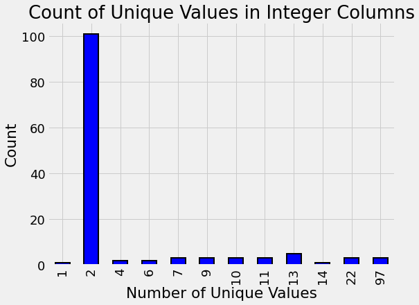
    


- 두 개의 고유 값만 있는 열은 부울(0 또는 1)을 나타낸다
- 대부분의 경우 이 부울 정보는 이미 가구 수준에 있다
- 가구 수준의 부울 열에서 형상을 만들어야 할 때, 우리는 이것들을 집계할 필요가 없지만 개인 수준에 있는 부울 열을 집계해야 합니다.

**Float Columns**

또 다른 열 유형은 연속형 변수를 나타내는 부동 행렬은 키와 값을 지정한 순서대로 유지하므로 `OrderdDict`를 사용하여 빈곤 수준을 색상으로 매핑한다


```python
# 가정의 빈곤 수준에 따른 변수 분포 확인
from collections import OrderedDict

plt.figure(figsize = (20, 16))
plt.style.use('fivethirtyeight')

# Color mapping
colors = OrderedDict({1: 'red', 2: 'orange', 3: 'blue', 4: 'green'})
poverty_mapping = OrderedDict({1: 'extreme', 2: 'moderate', 3: 'vulnerable', 4: 'non vulnerable'})

# Iterate through the float columns
for i, col in enumerate(train.select_dtypes('float')):
    ax = plt.subplot(4, 2, i + 1)
    # Iterate through the poverty levels
    for poverty_level, color in colors.items():
        # Plot each poverty level as a separate line
        sns.kdeplot(train.loc[train['Target'] == poverty_level, col].dropna(), 
                    ax = ax, color = color, label = poverty_mapping[poverty_level])
        
    plt.title(f'{col.capitalize()} Distribution'); plt.xlabel(f'{col}'); plt.ylabel('Density')

plt.subplots_adjust(top = 2)
```


    
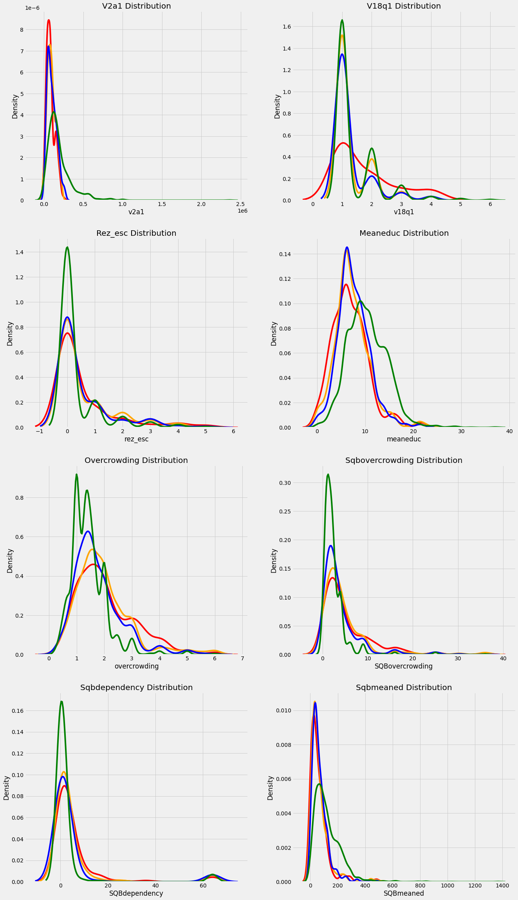
    


- 나중에 변수와 목표값 간의 상관 관계를 계산하여 형상 간의 관계를 측정하겠지만, 이러한 그림에서는 이미 모형과 가장 "관련" 있는 변수를 파악할 수 있다
- 예를 들어, 가정에서 성인의 평균 교육을 나타내는 평균 교육은 빈곤 수준과 관련이 있는 것으로 보인다\
    -> 높은 평균 성인 교육은 빈곤의 덜 심각한 수준의 목표의 더 높은 가치로 이어진다

**Object Columns**


```python
train.select_dtypes('object').head()
```


<div>
<style scoped>
    .dataframe tbody tr th:only-of-type {
        vertical-align: middle;
    }

    .dataframe tbody tr th {
        vertical-align: top;
    }

    .dataframe thead th {
        text-align: right;
    }
</style>
<table border="1" class="dataframe">
  <thead>
    <tr style="text-align: right;">
      <th></th>
      <th>Id</th>
      <th>idhogar</th>
      <th>dependency</th>
      <th>edjefe</th>
      <th>edjefa</th>
    </tr>
  </thead>
  <tbody>
    <tr>
      <th>0</th>
      <td>ID_279628684</td>
      <td>21eb7fcc1</td>
      <td>no</td>
      <td>10</td>
      <td>no</td>
    </tr>
    <tr>
      <th>1</th>
      <td>ID_f29eb3ddd</td>
      <td>0e5d7a658</td>
      <td>8</td>
      <td>12</td>
      <td>no</td>
    </tr>
    <tr>
      <th>2</th>
      <td>ID_68de51c94</td>
      <td>2c7317ea8</td>
      <td>8</td>
      <td>no</td>
      <td>11</td>
    </tr>
    <tr>
      <th>3</th>
      <td>ID_d671db89c</td>
      <td>2b58d945f</td>
      <td>yes</td>
      <td>11</td>
      <td>no</td>
    </tr>
    <tr>
      <th>4</th>
      <td>ID_d56d6f5f5</td>
      <td>2b58d945f</td>
      <td>yes</td>
      <td>11</td>
      <td>no</td>
    </tr>
  </tbody>
</table>
</div>


`dependency`,	`edjefe`,	`edjefa` 컬림에는 문자열과 숫자형 자료가 섞여 있다


```python
#문자열과 숫자가 섞여 있는 컬럼의 문자 데이터를 숫자로 매핑해주기
mapping = {"yes": 1, "no": 0}

# Apply same operation to both train and test
for df in [train, test]:
    # Fill in the values with the correct mapping
    df['dependency'] = df['dependency'].replace(mapping).astype(np.float64)
    df['edjefa'] = df['edjefa'].replace(mapping).astype(np.float64)
    df['edjefe'] = df['edjefe'].replace(mapping).astype(np.float64)

train[['dependency', 'edjefa', 'edjefe']].describe()
```


<div>
<style scoped>
    .dataframe tbody tr th:only-of-type {
        vertical-align: middle;
    }

    .dataframe tbody tr th {
        vertical-align: top;
    }

    .dataframe thead th {
        text-align: right;
    }
</style>
<table border="1" class="dataframe">
  <thead>
    <tr style="text-align: right;">
      <th></th>
      <th>dependency</th>
      <th>edjefa</th>
      <th>edjefe</th>
    </tr>
  </thead>
  <tbody>
    <tr>
      <th>count</th>
      <td>9557.000000</td>
      <td>9557.000000</td>
      <td>9557.000000</td>
    </tr>
    <tr>
      <th>mean</th>
      <td>1.149550</td>
      <td>2.896830</td>
      <td>5.096788</td>
    </tr>
    <tr>
      <th>std</th>
      <td>1.605993</td>
      <td>4.612056</td>
      <td>5.246513</td>
    </tr>
    <tr>
      <th>min</th>
      <td>0.000000</td>
      <td>0.000000</td>
      <td>0.000000</td>
    </tr>
    <tr>
      <th>25%</th>
      <td>0.333333</td>
      <td>0.000000</td>
      <td>0.000000</td>
    </tr>
    <tr>
      <th>50%</th>
      <td>0.666667</td>
      <td>0.000000</td>
      <td>6.000000</td>
    </tr>
    <tr>
      <th>75%</th>
      <td>1.333333</td>
      <td>6.000000</td>
      <td>9.000000</td>
    </tr>
    <tr>
      <th>max</th>
      <td>8.000000</td>
      <td>21.000000</td>
      <td>21.000000</td>
    </tr>
  </tbody>
</table>
</div>


```python
plt.figure(figsize = (16, 12))

# Iterate through the float columns
for i, col in enumerate(['dependency', 'edjefa', 'edjefe']):
    ax = plt.subplot(3, 1, i + 1)
    # Iterate through the poverty levels
    for poverty_level, color in colors.items():
        # Plot each poverty level as a separate line
        sns.kdeplot(train.loc[train['Target'] == poverty_level, col].dropna(), 
                    ax = ax, color = color, label = poverty_mapping[poverty_level])
        
    plt.title(f'{col.capitalize()} Distribution'); plt.xlabel(f'{col}'); plt.ylabel('Density')

plt.subplots_adjust(top = 2)
```


    
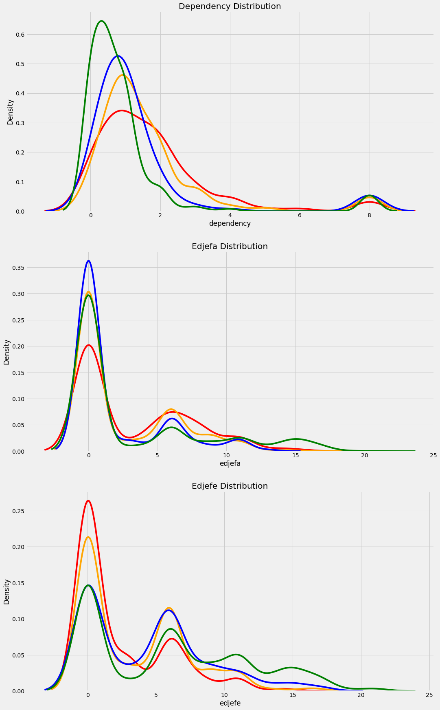
    


숫자형으로 잘 변환되었고, 이제 기계 학습 모델에 입력할 수 있다


```python
# train set과 test set에 동일한 feature engineering을 적용해주기 위해 두 데이터를 합침
## test데이터에는 target column이 없으므로 null라벨링을 해줌
test['Target'] = np.nan
data = train.append(test, ignore_index = True)
```

## - Exploring Label Distribution


```python
#target data의 분포 살펴보기
# Heads of household
heads = data.loc[data['parentesco1'] == 1].copy()

# Labels for training
train_labels = data.loc[(data['Target'].notnull()) & (data['parentesco1'] == 1), ['Target', 'idhogar']]

# Value counts of target
label_counts = train_labels['Target'].value_counts().sort_index()

# Bar plot of occurrences of each label
label_counts.plot.bar(figsize = (8, 6), 
                      color = colors.values(),
                      edgecolor = 'k', linewidth = 2)

# Formatting
plt.xlabel('Poverty Level'); plt.ylabel('Count'); 
plt.xticks([x - 1 for x in poverty_mapping.keys()], 
           list(poverty_mapping.values()), rotation = 60)
plt.title('Poverty Level Breakdown');

label_counts
```


    1.0     222
    2.0     442
    3.0     355
    4.0    1954
    Name: Target, dtype: int64


    
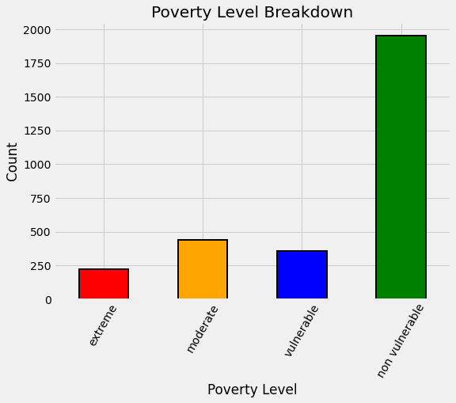
    


- 타겟의 분포를 보니 데이터가 불균형을 이루고 있다
- 기계 학습 모델이 소수 클래스를 잘 예측하지 못할 것
- 오버샘플링을 사용하여 불균형 문제를 해결할 수 있을 듯

## - Addressing Wrong Labels

**Identify Errors**

- 가족 구성원에 대한 라벨이 다른 가구를 찾기 위해, 가구별로 데이터를 그룹화한 다음 목표의 고유한 값이 하나만 있는지 확인


```python
# Groupby the household and figure out the number of unique values
all_equal = train.groupby('idhogar')['Target'].apply(lambda x: x.nunique() == 1)

# Households where targets are not all equal
not_equal = all_equal[all_equal != True]
print('There are {} households where the family members do not all have the same target.'.format(len(not_equal)))
```

    There are 85 households where the family members do not all have the same target.


```python
train[train['idhogar'] == not_equal.index[0]][['idhogar', 'parentesco1', 'Target']]
```


<div>
<style scoped>
    .dataframe tbody tr th:only-of-type {
        vertical-align: middle;
    }

    .dataframe tbody tr th {
        vertical-align: top;
    }

    .dataframe thead th {
        text-align: right;
    }
</style>
<table border="1" class="dataframe">
  <thead>
    <tr style="text-align: right;">
      <th></th>
      <th>idhogar</th>
      <th>parentesco1</th>
      <th>Target</th>
    </tr>
  </thead>
  <tbody>
    <tr>
      <th>7651</th>
      <td>0172ab1d9</td>
      <td>0</td>
      <td>3</td>
    </tr>
    <tr>
      <th>7652</th>
      <td>0172ab1d9</td>
      <td>0</td>
      <td>2</td>
    </tr>
    <tr>
      <th>7653</th>
      <td>0172ab1d9</td>
      <td>0</td>
      <td>3</td>
    </tr>
    <tr>
      <th>7654</th>
      <td>0172ab1d9</td>
      <td>1</td>
      <td>3</td>
    </tr>
    <tr>
      <th>7655</th>
      <td>0172ab1d9</td>
      <td>0</td>
      <td>2</td>
    </tr>
  </tbody>
</table>
</div>


`0172ab1d9` 가정의 가장이 `7654`번이고, 이 가장의 라벨이 `3`이므로 가족 구성원들은 모두 `3`으로 라벨을 수정해야 함

**Families without Heads of Household**

- 라벨이 일치하지 않는 경우 가장을 기준으로 수정하면 되지만 가장이 없는 집은 무엇을 기준으로 수정해야 할까


```python
households_leader = train.groupby('idhogar')['parentesco1'].sum()

# Find households without a head
households_no_head = train.loc[train['idhogar'].isin(households_leader[households_leader == 0].index), :]

print('There are {} households without a head.'.format(households_no_head['idhogar'].nunique()))
```

    There are 15 households without a head.


```python
# Find households without a head and where labels are different
households_no_head_equal = households_no_head.groupby('idhogar')['Target'].apply(lambda x: x.nunique() == 1)
print('{} Households with no head have different labels.'.format(sum(households_no_head_equal == False)))
```

    0 Households with no head have different labels.


다행히 그런 케이스는 없음

**Correct Errors**


```python
# Iterate through each household
for household in not_equal.index:
    # Find the correct label (for the head of household)
    true_target = int(train[(train['idhogar'] == household) & (train['parentesco1'] == 1.0)]['Target'])
    
    # Set the correct label for all members in the household
    train.loc[train['idhogar'] == household, 'Target'] = true_target
    
    
# Groupby the household and figure out the number of unique values
all_equal = train.groupby('idhogar')['Target'].apply(lambda x: x.nunique() == 1)

# Households where targets are not all equal
not_equal = all_equal[all_equal != True]
print('There are {} households where the family members do not all have the same target.'.format(len(not_equal)))
```

    There are 0 households where the family members do not all have the same target.


## - Missing Variables


```python
# Number of missing in each column
missing = pd.DataFrame(data.isnull().sum()).rename(columns = {0: 'total'})

# Create a percentage missing
missing['percent'] = missing['total'] / len(data)

missing.sort_values('percent', ascending = False).head(10).drop('Target') #테스트데이터에 추가한 null 값을 가진 Target column은 제외
```


<div>
<style scoped>
    .dataframe tbody tr th:only-of-type {
        vertical-align: middle;
    }

    .dataframe tbody tr th {
        vertical-align: top;
    }

    .dataframe thead th {
        text-align: right;
    }
</style>
<table border="1" class="dataframe">
  <thead>
    <tr style="text-align: right;">
      <th></th>
      <th>total</th>
      <th>percent</th>
    </tr>
  </thead>
  <tbody>
    <tr>
      <th>rez_esc</th>
      <td>27581</td>
      <td>0.825457</td>
    </tr>
    <tr>
      <th>v18q1</th>
      <td>25468</td>
      <td>0.762218</td>
    </tr>
    <tr>
      <th>v2a1</th>
      <td>24263</td>
      <td>0.726154</td>
    </tr>
    <tr>
      <th>SQBmeaned</th>
      <td>36</td>
      <td>0.001077</td>
    </tr>
    <tr>
      <th>meaneduc</th>
      <td>36</td>
      <td>0.001077</td>
    </tr>
    <tr>
      <th>hogar_adul</th>
      <td>0</td>
      <td>0.000000</td>
    </tr>
    <tr>
      <th>parentesco10</th>
      <td>0</td>
      <td>0.000000</td>
    </tr>
    <tr>
      <th>parentesco11</th>
      <td>0</td>
      <td>0.000000</td>
    </tr>
    <tr>
      <th>parentesco12</th>
      <td>0</td>
      <td>0.000000</td>
    </tr>
  </tbody>
</table>
</div>


- 결측치의 비율이 높은 세 개의 컬럼을 가지고 결측치 처리 시행

**Function to Plot Value Counts**


```python
def plot_value_counts(df, col, heads_only = False):
    """Plot value counts of a column, optionally with only the heads of a household"""
    # Select heads of household
    if heads_only:
        df = df.loc[df['parentesco1'] == 1].copy()
        
    plt.figure(figsize = (8, 6))
    df[col].value_counts().sort_index().plot.bar(color = 'blue',
                                                 edgecolor = 'k',
                                                 linewidth = 2)
    plt.xlabel(f'{col}'); plt.title(f'{col} Value Counts'); plt.ylabel('Count')
    plt.show();
```


```python
plot_value_counts(heads, 'v18q1')
```


    
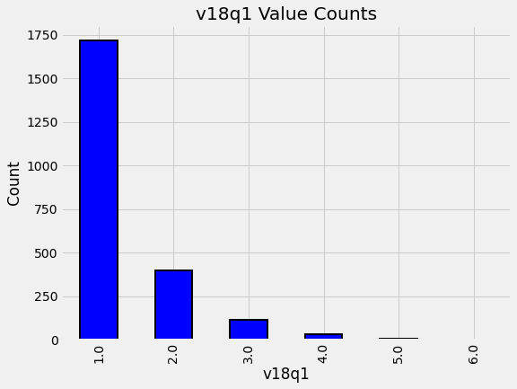
    


- 위 표에서 대부분 1개의 태블릿을 소유하고 있는 것을 확인할 수 있다
- 하나도 소유하고 있지 않은 경우는 결측치로 처리되어 표에 나타나지 않을 수 있다
- `v18q` column은 태블릿 소유 여부를 나타내므로 이 컬럼도 같이 확인하여 위 가설을 확인해보자


```python
#v18q 값(태블릿 소유의 경우 1이고 그렇지 않은 경우 0)으로 그룹화한 다음 v18q1에 대한 null 값의 수를 계산
heads.groupby('v18q')['v18q1'].apply(lambda x: x.isnull().sum())
```


    v18q
    0    8044
    1       0
    Name: v18q1, dtype: int64


- 가설 대로 태블릿을 소유하지 않은 경우 결측치로 처리됨


```python
# v18q1 column의 결측치를 0으로 채움
data['v18q1'] = data['v18q1'].fillna(0)
```

- 다음으로 살펴볼 column은 `v2a1` : 월세 지불에 관한 column
- 주택의 소유/임대 상태를 나타내는 칼럼인 `tipovivi_`의 분포도 함께 살펴보자


```python
# Variables indicating home ownership
own_variables = [x for x in data if x.startswith('tipo')]


# Plot of the home ownership variables for home missing rent payments
data.loc[data['v2a1'].isnull(), own_variables].sum().plot.bar(figsize = (10, 8),
                                                                        color = 'green',
                                                              edgecolor = 'k', linewidth = 2);
plt.xticks([0, 1, 2, 3, 4],
           ['Owns and Paid Off', 'Owns and Paying', 'Rented', 'Precarious', 'Other'],
          rotation = 60)
plt.title('Home Ownership Status for Households Missing Rent Payments', size = 18);
```


    
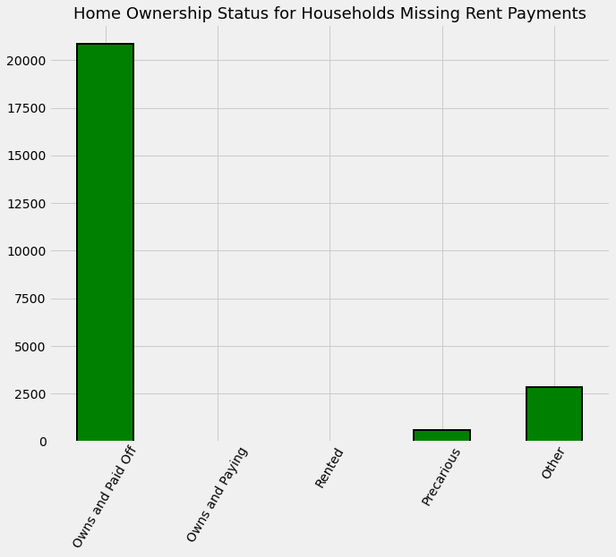
    


```python
#각 변수의 의미
tipovivi1, =1 own and fully paid house
tipovivi2, "=1 own,  paying in installments"
tipovivi3, =1 rented
tipovivi4, =1 precarious
tipovivi5, "=1 other(assigned,  borrowed)"
```

- 월세를 내지 않는 가정들은 보통 자신의 집을 가지고 있다


```python
# 소유한 주택에 대해 월세 납입금이 누락된 주택에 대해서는 월세 납입액을 0으로 설정
data.loc[(data['tipovivi1'] == 1), 'v2a1'] = 0

# 결측치를 채우는 대신 결측치 여부를 알려주는 부울을 추가
data['v2a1-missing'] = data['v2a1'].isnull()

data['v2a1-missing'].value_counts()
```


    False    29994
    True      3419
    Name: v2a1-missing, dtype: int64


- 마지막으로 살펴볼 column은 `rez_esc`로, 학창시절 뒤처진 연도를 나타낸다
- 값이 `null`인 가정의 경우, 현재 학교에 입학한 자녀가 없을 수 있음
- 이 열에 결측값이 있는 사람들의 연령과 결측값이 없는 사람들의 연령을 확인해보자


```python
data.loc[data['rez_esc'].notnull()]['age'].describe()
```


    count    5832.000000
    mean       12.185700
    std         3.198618
    min         7.000000
    25%         9.000000
    50%        12.000000
    75%        15.000000
    max        17.000000
    Name: age, dtype: float64


- 결측치는 17보다 클 수 없다
- 17보다 나이가 많은 사람이라면, 학교에 다니지 않는다고 가정할 수 있을 것
- 결측값을 가진 사람들의 연령을 살펴보자


```python
data.loc[data['rez_esc'].isnull()]['age'].describe()
```


    count    27581.000000
    mean        39.110656
    std         20.983114
    min          0.000000
    25%         24.000000
    50%         38.000000
    75%         54.000000
    max         97.000000
    Name: age, dtype: float64


- 해당 변수는 7세에서 19세 사이의 개인에게만 정의된다 
- 이 범위보다 어리거나 나이가 많은 사람은 년도 뒤처지지 않으므로 값을 0으로 설정해야 함
- 이 변수의 경우 개인이 19세 이상이고 결측값이 있거나 7세 미만이고 결측값이 있는 경우 0으로 설정
- 그 외의 케이스는 경우 값을 그대로 두고 부울 플래그를 추가


```python
# If individual is over 19 or younger than 7 and missing years behind, set it to 0
data.loc[((data['age'] > 19) | (data['age'] < 7)) & (data['rez_esc'].isnull()), 'rez_esc'] = 0

# Add a flag for those between 7 and 19 with a missing value
data['rez_esc-missing'] = data['rez_esc'].isnull()
```

- `rez_esc` 변수의 최대값은 5
- 5 이상의 값은 5로 설정해야 함


```python
data.loc[data['rez_esc'] > 5, 'rez_esc'] = 5
```

## - Plot Two Categorical Variables


```python
def plot_categoricals(x, y, data, annotate = True):
    """Plot counts of two categoricals.
    Size is raw count for each grouping.
    Percentages are for a given value of y."""
    
    # Raw counts 
    raw_counts = pd.DataFrame(data.groupby(y)[x].value_counts(normalize = False))
    raw_counts = raw_counts.rename(columns = {x: 'raw_count'})
    
    # Calculate counts for each group of x and y
    counts = pd.DataFrame(data.groupby(y)[x].value_counts(normalize = True))
    
    # Rename the column and reset the index
    counts = counts.rename(columns = {x: 'normalized_count'}).reset_index()
    counts['percent'] = 100 * counts['normalized_count']
    
    # Add the raw count
    counts['raw_count'] = list(raw_counts['raw_count'])
    
    plt.figure(figsize = (14, 10))
    # Scatter plot sized by percent
    plt.scatter(counts[x], counts[y], edgecolor = 'k', color = 'lightgreen',
                s = 100 * np.sqrt(counts['raw_count']), marker = 'o',
                alpha = 0.6, linewidth = 1.5)
    
    if annotate:
        # Annotate the plot with text
        for i, row in counts.iterrows():
            # Put text with appropriate offsets
            plt.annotate(xy = (row[x] - (1 / counts[x].nunique()), 
                               row[y] - (0.15 / counts[y].nunique())),
                         color = 'navy',
                         s = f"{round(row['percent'], 1)}%")
        
    # Set tick marks
    plt.yticks(counts[y].unique())
    plt.xticks(counts[x].unique())
    
    # Transform min and max to evenly space in square root domain
    sqr_min = int(np.sqrt(raw_counts['raw_count'].min()))
    sqr_max = int(np.sqrt(raw_counts['raw_count'].max()))
    
    # 5 sizes for legend
    msizes = list(range(sqr_min, sqr_max,
                        int(( sqr_max - sqr_min) / 5)))
    markers = []
    
    # Markers for legend
    for size in msizes:
        markers.append(plt.scatter([], [], s = 100 * size, 
                                   label = f'{int(round(np.square(size) / 100) * 100)}', 
                                   color = 'lightgreen',
                                   alpha = 0.6, edgecolor = 'k', linewidth = 1.5))
        
    # Legend and formatting
    plt.legend(handles = markers, title = 'Counts',
               labelspacing = 3, handletextpad = 2,
               fontsize = 16,
               loc = (1.10, 0.19))
    
    plt.annotate(f'* Size represents raw count while % is for a given y value.',
                 xy = (0, 1), xycoords = 'figure points', size = 10)
    
    # Adjust axes limits
    plt.xlim((counts[x].min() - (6 / counts[x].nunique()), 
              counts[x].max() + (6 / counts[x].nunique())))
    plt.ylim((counts[y].min() - (4 / counts[y].nunique()), 
              counts[y].max() + (4 / counts[y].nunique())))
    plt.grid(None)
    plt.xlabel(f"{x}"); plt.ylabel(f"{y}"); plt.title(f"{y} vs {x}");
```


```python
plot_categoricals('rez_esc', 'Target', data);
```

    <ipython-input-37-b5cc8cc1cf28>:30: MatplotlibDeprecationWarning: The 's' parameter of annotate() has been renamed 'text' since Matplotlib 3.3; support for the old name will be dropped two minor releases later.
      plt.annotate(xy = (row[x] - (1 / counts[x].nunique()),


    
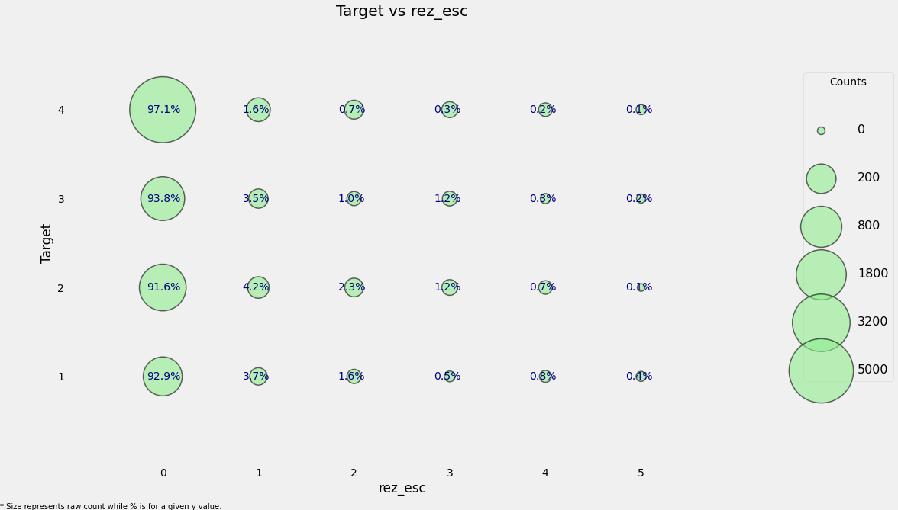
    


```python
plot_categoricals('escolari', 'Target', data, annotate = False)
```


    
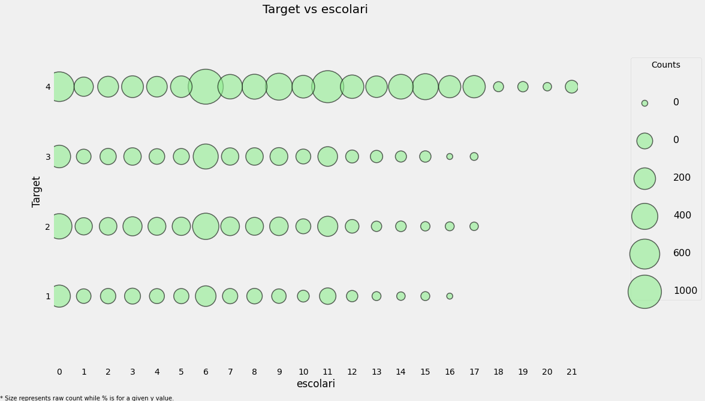
    


- 각 열의 나머지 결측값은 `Imputation`을 이용해 채움
- 가장 간단하고 효과적인 방법 중 하나는 결측값을 열의 `median`로 채우는 것


```python
plot_value_counts(data[(data['rez_esc-missing'] == 1)], 
                  'Target')
```


    
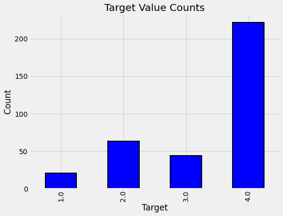
    


```python
plot_value_counts(data[(data['v2a1-missing'] == 1)], 
                  'Target')
```


    
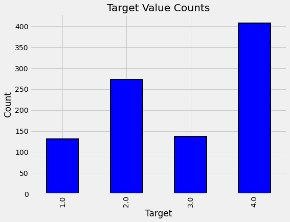
    


# 3. Feature Engineering

## - Column Definitions

변수 범주 정의
- Individual Variables : 가구보다는 개인의 특성
    + `ind_bool` : 예 또는 아니오(0 또는 1)
    + `ind_ordered` : 순서가 있는 정수
- Household variables
    + `hh_bool` : 예 또는 아니오
    + `hh_ordered` : 순서가 있는 정수
    + `hh_cont`
- `sqr_` : 데이터의 제곱 변수에서 파생됨
- `id_`: 데이터를 식별


```python
id_ = ['Id', 'idhogar', 'Target']
```


```python
ind_bool = ['v18q', 'dis', 'male', 'female', 'estadocivil1', 'estadocivil2', 'estadocivil3', 
            'estadocivil4', 'estadocivil5', 'estadocivil6', 'estadocivil7', 
            'parentesco1', 'parentesco2',  'parentesco3', 'parentesco4', 'parentesco5', 
            'parentesco6', 'parentesco7', 'parentesco8',  'parentesco9', 'parentesco10', 
            'parentesco11', 'parentesco12', 'instlevel1', 'instlevel2', 'instlevel3', 
            'instlevel4', 'instlevel5', 'instlevel6', 'instlevel7', 'instlevel8', 
            'instlevel9', 'mobilephone', 'rez_esc-missing']

ind_ordered = ['rez_esc', 'escolari', 'age']
```


```python
hh_bool = ['hacdor', 'hacapo', 'v14a', 'refrig', 'paredblolad', 'paredzocalo', 
           'paredpreb','pisocemento', 'pareddes', 'paredmad',
           'paredzinc', 'paredfibras', 'paredother', 'pisomoscer', 'pisoother', 
           'pisonatur', 'pisonotiene', 'pisomadera',
           'techozinc', 'techoentrepiso', 'techocane', 'techootro', 'cielorazo', 
           'abastaguadentro', 'abastaguafuera', 'abastaguano',
            'public', 'planpri', 'noelec', 'coopele', 'sanitario1', 
           'sanitario2', 'sanitario3', 'sanitario5',   'sanitario6',
           'energcocinar1', 'energcocinar2', 'energcocinar3', 'energcocinar4', 
           'elimbasu1', 'elimbasu2', 'elimbasu3', 'elimbasu4', 
           'elimbasu5', 'elimbasu6', 'epared1', 'epared2', 'epared3',
           'etecho1', 'etecho2', 'etecho3', 'eviv1', 'eviv2', 'eviv3', 
           'tipovivi1', 'tipovivi2', 'tipovivi3', 'tipovivi4', 'tipovivi5', 
           'computer', 'television', 'lugar1', 'lugar2', 'lugar3',
           'lugar4', 'lugar5', 'lugar6', 'area1', 'area2', 'v2a1-missing']

hh_ordered = [ 'rooms', 'r4h1', 'r4h2', 'r4h3', 'r4m1','r4m2','r4m3', 'r4t1',  'r4t2', 
              'r4t3', 'v18q1', 'tamhog','tamviv','hhsize','hogar_nin',
              'hogar_adul','hogar_mayor','hogar_total',  'bedrooms', 'qmobilephone']

hh_cont = ['v2a1', 'dependency', 'edjefe', 'edjefa', 'meaneduc', 'overcrowding']
```


```python
sqr_ = ['SQBescolari', 'SQBage', 'SQBhogar_total', 'SQBedjefe', 
        'SQBhogar_nin', 'SQBovercrowding', 'SQBdependency', 'SQBmeaned', 'agesq']
```


```python
#빠트린 데이터가 없는지, 중복된 데이터는 없는지 확인
x = ind_bool + ind_ordered + id_ + hh_bool + hh_ordered + hh_cont + sqr_

from collections import Counter

print('There are no repeats: ', np.all(np.array(list(Counter(x).values())) == 1))
print('We covered every variable: ', len(x) == data.shape[1])
```

    There are no repeats:  True
    We covered every variable:  True


## - Squared Variables

제곱 변수를 모두 제거 -> 높은 상관 관계를 가진 변수들을 하나로 압축


```python
# Remove squared variables
data = data.drop(columns = sqr_)
data.shape
```


    (33413, 136)


## - Household Level Variables


```python
#가장들의 가계 수준 변수 살펴보기
heads = data.loc[data['parentesco1'] == 1, :]
heads = heads[id_ + hh_bool + hh_cont + hh_ordered]
heads.shape
```


    (10307, 99)


**Redundant Household Variables**

- 모든 가정 변수 간의 상관 관계를 살펴보자
- 상관 관계가 너무 높은 변수가 있으면 상관 관계가 높은 변수 쌍 중 하나를 제거


```python
# 상관 관계가 0.95보다 큰 변수 확인
# Create correlation matrix
corr_matrix = heads.corr()

# Select upper triangle of correlation matrix
upper = corr_matrix.where(np.triu(np.ones(corr_matrix.shape), k=1).astype(np.bool))

# Find index of feature columns with correlation greater than 0.95
to_drop = [column for column in upper.columns if any(abs(upper[column]) > 0.95)]

to_drop
```


    ['coopele', 'area2', 'tamhog', 'hhsize', 'hogar_total']


```python
corr_matrix.loc[corr_matrix['tamhog'].abs() > 0.9, corr_matrix['tamhog'].abs() > 0.9]
```


<div>
<style scoped>
    .dataframe tbody tr th:only-of-type {
        vertical-align: middle;
    }

    .dataframe tbody tr th {
        vertical-align: top;
    }

    .dataframe thead th {
        text-align: right;
    }
</style>
<table border="1" class="dataframe">
  <thead>
    <tr style="text-align: right;">
      <th></th>
      <th>r4t3</th>
      <th>tamhog</th>
      <th>tamviv</th>
      <th>hhsize</th>
      <th>hogar_total</th>
    </tr>
  </thead>
  <tbody>
    <tr>
      <th>r4t3</th>
      <td>1.000000</td>
      <td>0.998287</td>
      <td>0.910457</td>
      <td>0.998287</td>
      <td>0.998287</td>
    </tr>
    <tr>
      <th>tamhog</th>
      <td>0.998287</td>
      <td>1.000000</td>
      <td>0.909155</td>
      <td>1.000000</td>
      <td>1.000000</td>
    </tr>
    <tr>
      <th>tamviv</th>
      <td>0.910457</td>
      <td>0.909155</td>
      <td>1.000000</td>
      <td>0.909155</td>
      <td>0.909155</td>
    </tr>
    <tr>
      <th>hhsize</th>
      <td>0.998287</td>
      <td>1.000000</td>
      <td>0.909155</td>
      <td>1.000000</td>
      <td>1.000000</td>
    </tr>
    <tr>
      <th>hogar_total</th>
      <td>0.998287</td>
      <td>1.000000</td>
      <td>0.909155</td>
      <td>1.000000</td>
      <td>1.000000</td>
    </tr>
  </tbody>
</table>
</div>


```python
sns.heatmap(corr_matrix.loc[corr_matrix['tamhog'].abs() > 0.9, corr_matrix['tamhog'].abs() > 0.9],
            annot=True, cmap = plt.cm.autumn_r, fmt='.3f');
```


    
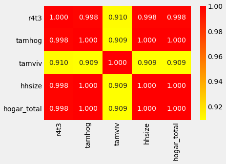
    


- `hhsize`는 `tamhog`와 `hogar_total`과 완벽한 상관관계를 가지고 있음 -> 정보가 중복되기 때문에 이 두 변수를 제거
- `r4t3`은 `hhsize`와 거의 완벽한 상관관계를 가지고 있기 때문에 제거할 수 있다
- `tamviv`는 가정에 살고 있지 않은 가족들이 있을 수 있기 때문에 반드시 `hhsize`와 같은 것은 아니다 -> 산점도로 확인해보자


```python
heads = heads.drop(columns = ['tamhog', 'hogar_total', 'r4t3'])
```


```python
sns.lmplot('tamviv', 'hhsize', data, fit_reg=False, size = 8);
plt.title('Household size vs number of persons living in the household');
```

    /Users/nahyunsong/opt/anaconda3/lib/python3.8/site-packages/seaborn/_decorators.py:36: FutureWarning: Pass the following variables as keyword args: x, y, data. From version 0.12, the only valid positional argument will be `data`, and passing other arguments without an explicit keyword will result in an error or misinterpretation.
      warnings.warn(
    /Users/nahyunsong/opt/anaconda3/lib/python3.8/site-packages/seaborn/regression.py:580: UserWarning: The `size` parameter has been renamed to `height`; please update your code.
      warnings.warn(msg, UserWarning)


    

    


```python
#tamviv와 hhsize의 차이를 나타내는 Feature생성
heads['hhsize-diff'] = heads['tamviv'] - heads['hhsize']
plot_categoricals('hhsize-diff', 'Target', heads)
```

    <ipython-input-37-b5cc8cc1cf28>:30: MatplotlibDeprecationWarning: The 's' parameter of annotate() has been renamed 'text' since Matplotlib 3.3; support for the old name will be dropped two minor releases later.
      plt.annotate(xy = (row[x] - (1 / counts[x].nunique()),


    
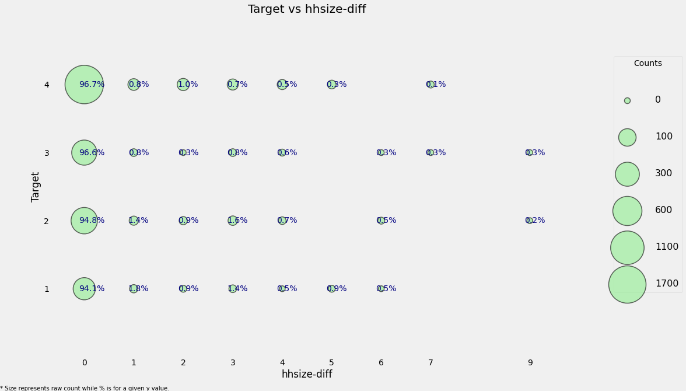
    


대부분의 가정이 차이가 없지만, 가구원보다 더 많은 사람들이 그 가구에 살고 있다


```python
#public, coopele 변수 살펴보기
corr_matrix.loc[corr_matrix['coopele'].abs() > 0.9, corr_matrix['coopele'].abs() > 0.9]
```


<div>
<style scoped>
    .dataframe tbody tr th:only-of-type {
        vertical-align: middle;
    }

    .dataframe tbody tr th {
        vertical-align: top;
    }

    .dataframe thead th {
        text-align: right;
    }
</style>
<table border="1" class="dataframe">
  <thead>
    <tr style="text-align: right;">
      <th></th>
      <th>public</th>
      <th>coopele</th>
    </tr>
  </thead>
  <tbody>
    <tr>
      <th>public</th>
      <td>1.000000</td>
      <td>-0.967759</td>
    </tr>
    <tr>
      <th>coopele</th>
      <td>-0.967759</td>
      <td>1.000000</td>
    </tr>
  </tbody>
</table>
</div>


**Creating Ordinal Variable**

순서형 변수를 만들어 네 변수를 하나로 압축


```python
0: No electricity
1: Electricity from cooperative
2: Electricity from CNFL, ICA, ESPH/JASEC
3: Electricity from private plant
```

- 정렬된 변수는 고유한 순서가 있으며, 이를 위해 도메인 지식을 기반으로 자체적인 변수를 선택
- 새 순서 변수를 생성한 후 나머지 4개를 삭제
- 변수가 없는 가구는 `NaN`을 사용하고 이 변수에 대한 측정이 없음을 나타내는 부울 열을 추가할 것


```python
elec = []

# Assign values
for i, row in heads.iterrows():
    if row['noelec'] == 1:
        elec.append(0)
    elif row['coopele'] == 1:
        elec.append(1)
    elif row['public'] == 1:
        elec.append(2)
    elif row['planpri'] == 1:
        elec.append(3)
    else:
        elec.append(np.nan)
        
# 새 순서 변수를 생성
heads['elec'] = elec
#변수가 없는 가구는 NaN을 사용하고 이 변수에 대한 측정이 없음을 나타내는 부울 열을 추가
heads['elec-missing'] = heads['elec'].isnull()

# 새 순서 변수를 생성한 후 나머지 4개를 삭제
# heads = heads.drop(columns = ['noelec', 'coopele', 'public', 'planpri'])
```


```python
plot_categoricals('elec', 'Target', heads)
```

    <ipython-input-37-b5cc8cc1cf28>:30: MatplotlibDeprecationWarning: The 's' parameter of annotate() has been renamed 'text' since Matplotlib 3.3; support for the old name will be dropped two minor releases later.
      plt.annotate(xy = (row[x] - (1 / counts[x].nunique()),


    
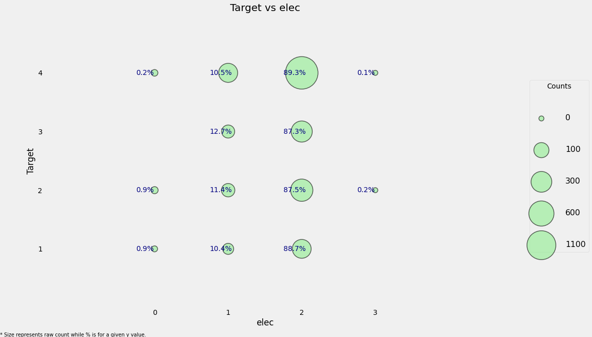
    


- `area2` : 집이 시골 지역에 있다는 것을 의미 -> 집이 도시 지역에 있는지를 나타내는 칼럼을 가지고 있기 때문에 삭제


```python
heads = heads.drop(columns = 'area2')

heads.groupby('area1')['Target'].value_counts(normalize = True)
```


    area1  Target
    0      4.0       0.582249
           2.0       0.176331
           3.0       0.147929
           1.0       0.093491
    1      4.0       0.687030
           2.0       0.137688
           3.0       0.108083
           1.0       0.067199
    Name: Target, dtype: float64


도시 지역 가구(1)는 시골 지역 가구(0)보다 빈곤 수준이 낮을 것으로 보인다.

## - Creating Ordinal Variables

- 집의 벽, 지붕, 바닥에는 각각 세 개의 column이 있다 -> `bad`,`regular`,`good`
- 변수를 부울란으로 둘 수도 있지만 고유 순서가 있기 때문에 순서형 변수로 바꾸는 것이 더 타당하다
- np.argmax를 사용하여 각 가정에 대해 0이 아닌 열을 찾아보자


```python
# Wall ordinal variable
heads['walls'] = np.argmax(np.array(heads[['epared1', 'epared2', 'epared3']]),
                           axis = 1)

# heads = heads.drop(columns = ['epared1', 'epared2', 'epared3']) #순서형 변수를 만든 후에는 원래 변수를 삭제
plot_categoricals('walls', 'Target', heads)
```

    <ipython-input-37-b5cc8cc1cf28>:30: MatplotlibDeprecationWarning: The 's' parameter of annotate() has been renamed 'text' since Matplotlib 3.3; support for the old name will be dropped two minor releases later.
      plt.annotate(xy = (row[x] - (1 / counts[x].nunique()),


    
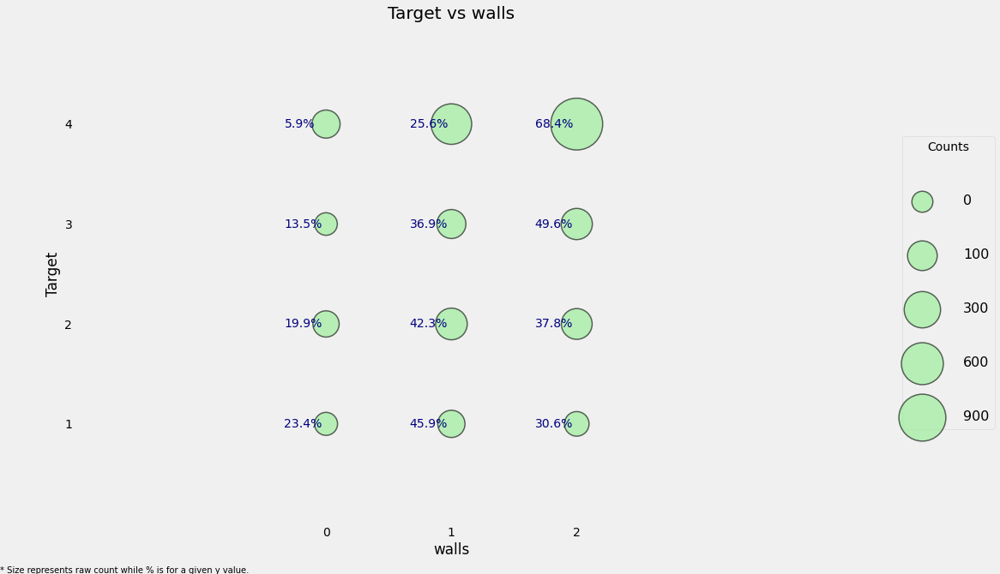
    


```python
# Roof ordinal variable
heads['roof'] = np.argmax(np.array(heads[['etecho1', 'etecho2', 'etecho3']]),
                           axis = 1)
heads = heads.drop(columns = ['etecho1', 'etecho2', 'etecho3'])

# Floor ordinal variable
heads['floor'] = np.argmax(np.array(heads[['eviv1', 'eviv2', 'eviv3']]),
                           axis = 1)
# heads = heads.drop(columns = ['eviv1', 'eviv2', 'eviv3'])
```

## - Feature Construction


```python
# 집 구조의 질을 전반적으로 측정하기 위해 새로운 feature 생성
heads['walls+roof+floor'] = heads['walls'] + heads['roof'] + heads['floor']

plot_categoricals('walls+roof+floor', 'Target', heads, annotate=False)
```


    
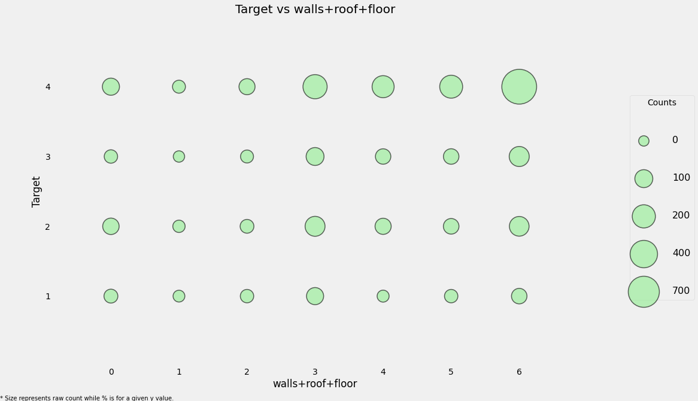
    


이 새로운 feature는 목표치 4(최저 빈곤 수준)가 '집 품질' 변수의 값이 더 높은 경향이 있는 것처럼 보이기 때문에 유용할 수 있다


```python
#세부사항 확인
counts = pd.DataFrame(heads.groupby(['walls+roof+floor'])['Target'].value_counts(normalize = True)).rename(columns = {'Target': 'Normalized Count'}).reset_index()
counts.head()
```


<div>
<style scoped>
    .dataframe tbody tr th:only-of-type {
        vertical-align: middle;
    }

    .dataframe tbody tr th {
        vertical-align: top;
    }

    .dataframe thead th {
        text-align: right;
    }
</style>
<table border="1" class="dataframe">
  <thead>
    <tr style="text-align: right;">
      <th></th>
      <th>walls+roof+floor</th>
      <th>Target</th>
      <th>Normalized Count</th>
    </tr>
  </thead>
  <tbody>
    <tr>
      <th>0</th>
      <td>0</td>
      <td>4.0</td>
      <td>0.376404</td>
    </tr>
    <tr>
      <th>1</th>
      <td>0</td>
      <td>2.0</td>
      <td>0.320225</td>
    </tr>
    <tr>
      <th>2</th>
      <td>0</td>
      <td>1.0</td>
      <td>0.162921</td>
    </tr>
    <tr>
      <th>3</th>
      <td>0</td>
      <td>3.0</td>
      <td>0.140449</td>
    </tr>
    <tr>
      <th>4</th>
      <td>1</td>
      <td>4.0</td>
      <td>0.323529</td>
    </tr>
  </tbody>
</table>
</div>


```python
# 품질 감점사항 추가 - No toilet, no electricity, no floor, no water service, no ceiling
heads['warning'] = 1 * (heads['sanitario1'] + 
                         (heads['elec'] == 0) + 
                         heads['pisonotiene'] + 
                         heads['abastaguano'] + 
                         (heads['cielorazo'] == 0))
```


```python
#seaborn으로 시각화 - 바이올린플롯
plt.figure(figsize = (10, 6))
sns.violinplot(x = 'warning', y = 'Target', data = heads);
plt.title('Target vs Warning Variable');
```


    
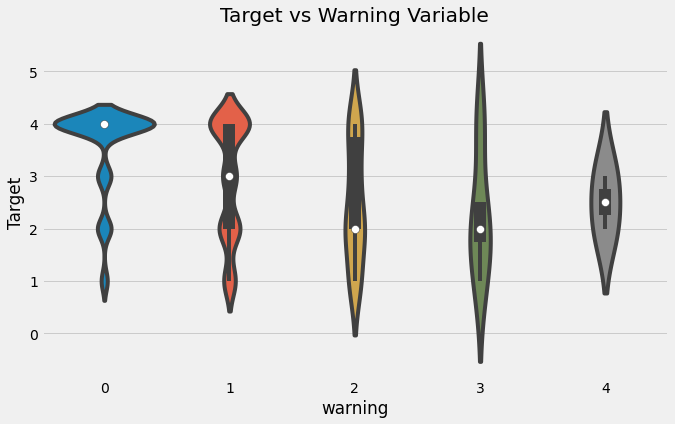
    


```python
plot_categoricals('warning', 'Target', data = heads)
```

    <ipython-input-37-b5cc8cc1cf28>:30: MatplotlibDeprecationWarning: The 's' parameter of annotate() has been renamed 'text' since Matplotlib 3.3; support for the old name will be dropped two minor releases later.
      plt.annotate(xy = (row[x] - (1 / counts[x].nunique()),


    
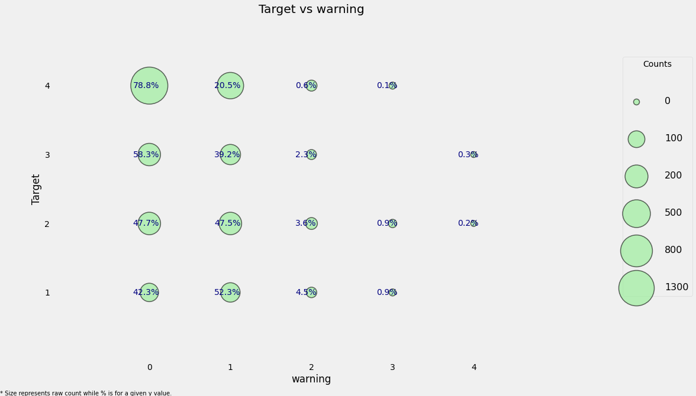
    


- 품질 감점이 없고 가장 빈곤 수준이 낮은 가구들이 많은 것을 확인 -> 모델링을 시작하기 전까지는 확신할 수 없음

- 품질 가점 feature 추가 -> 냉장고, 컴퓨터, 태블릿, 또는 텔레비전을 가지고 있으면 가점을 얻음


```python
# Owns a refrigerator, computer, tablet, and television
heads['bonus'] = 1 * (heads['refrig'] + 
                      heads['computer'] + 
                      (heads['v18q1'] > 0) + 
                      heads['television'])

sns.violinplot('bonus', 'Target', data = heads,
                figsize = (10, 6));
plt.title('Target vs Bonus Variable');
```

    /Users/nahyunsong/opt/anaconda3/lib/python3.8/site-packages/seaborn/_decorators.py:36: FutureWarning: Pass the following variables as keyword args: x, y. From version 0.12, the only valid positional argument will be `data`, and passing other arguments without an explicit keyword will result in an error or misinterpretation.
      warnings.warn(


    
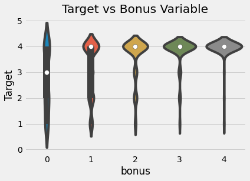
    


## - Per Capita Features


```python
#가정의 각 개인에 대한 특정 측정치를 나타내는 feature 추가
heads['phones-per-capita'] = heads['qmobilephone'] / heads['tamviv']
heads['tablets-per-capita'] = heads['v18q1'] / heads['tamviv']
heads['rooms-per-capita'] = heads['rooms'] / heads['tamviv']
heads['rent-per-capita'] = heads['v2a1'] / heads['tamviv']
```

## - Exploring Household Variables

**Measuring Relationships**

두 변수 간의 관계를 측정하는 두 가지 방법

- 피어슨 상관 관계: -1부터 1까지 두 변수 간의 선형 관계 측정
- 스피어맨 상관 관계: -1부터 1까지 두 변수 간의 단조 관계 측정

스피어맨 상관 변수는 관계가 선형적이지 않더라도 한 변수가 증가할 때 다른 변수도 증가하면 그 값이 1이다.\
반면 피어슨 상관 변수는 증가량이 정확히 선형인 경우에만 1이 될 수 있다.


```python
from scipy.stats import spearmanr
```


```python
#목표값과 모든 변수의 피어슨 상관 관계를 계산
# Use only training data
train_heads = heads.loc[heads['Target'].notnull(), :].copy()

pcorrs = pd.DataFrame(train_heads.corr()['Target'].sort_values()).rename(columns = {'Target': 'pcorr'}).reset_index()
pcorrs = pcorrs.rename(columns = {'index': 'feature'})

print('Most negatively correlated variables:')
print(pcorrs.head())

print('\nMost positively correlated variables:')
print(pcorrs.dropna().tail())
```

    Most negatively correlated variables:
            feature     pcorr
    0       warning -0.301791
    1     hogar_nin -0.266309
    2          r4t1 -0.260917
    3  overcrowding -0.234954
    4         eviv1 -0.217908
    
    Most positively correlated variables:
                   feature     pcorr
    97   phones-per-capita  0.299026
    98               floor  0.307605
    99    walls+roof+floor  0.332446
    100           meaneduc  0.333652
    101             Target  1.000000


- 음의 상관 관계의 경우 
    + 변수를 늘리면 목표값이 감소하여 빈곤 심각도가 증가
    + 경고가 증가할수록, 빈곤 수준도 증가 -> 집에 대해 나쁜 징후를 보이기 위한 것이었기 때문
    + 가족의 크기와 가난 사이에는 진정한 연관성이 있다
- 양의 상관 관계의 경우
    + 가장 높은 상관관계가 있는 가계 수준 변수는 평균 교육, 즉 성인의 평균 교육 수준
    + 더 높은 수준의 교육은 일반적으로 더 낮은 수준의 빈곤과 관련이 있다

- 상관관계 값에 대한 일반적인 지침
    - .00-.19 “very weak”
    - .20-.39 “weak”
    - .40-.59 “moderate”
    - .60-.79 “strong”
    - .80-1.0 “very strong”


```python
#스피어슨 상관관계 확인
import warnings
warnings.filterwarnings('ignore', category = RuntimeWarning)

feats = []
scorr = []
pvalues = []

# Iterate through each column
for c in heads:
    # Only valid for numbers
    if heads[c].dtype != 'object':
        feats.append(c)
        
        # Calculate spearman correlation
        scorr.append(spearmanr(train_heads[c], train_heads['Target']).correlation)
        pvalues.append(spearmanr(train_heads[c], train_heads['Target']).pvalue)

scorrs = pd.DataFrame({'feature': feats, 'scorr': scorr, 'pvalue': pvalues}).sort_values('scorr')
```


```python
print('Most negative Spearman correlations:')
print(scorrs.head())
print('\nMost positive Spearman correlations:')
print(scorrs.dropna().tail())
```

    Most negative Spearman correlations:
           feature     scorr        pvalue
    97     warning -0.307326  4.682829e-66
    68  dependency -0.281516  2.792620e-55
    85   hogar_nin -0.236225  5.567218e-39
    80        r4t1 -0.219226  1.112230e-33
    49       eviv1 -0.217803  2.952571e-33
    
    Most positive Spearman correlations:
                  feature     scorr        pvalue
    23          cielorazo  0.300996  2.611808e-63
    95              floor  0.309638  4.466091e-67
    99  phones-per-capita  0.337377  4.760104e-80
    96   walls+roof+floor  0.338791  9.539346e-81
    0              Target  1.000000  0.000000e+00


```python
corrs = pcorrs.merge(scorrs, on = 'feature')
corrs['diff'] = corrs['pcorr'] - corrs['scorr']

corrs.sort_values('diff').head()
```


<div>
<style scoped>
    .dataframe tbody tr th:only-of-type {
        vertical-align: middle;
    }

    .dataframe tbody tr th {
        vertical-align: top;
    }

    .dataframe thead th {
        text-align: right;
    }
</style>
<table border="1" class="dataframe">
  <thead>
    <tr style="text-align: right;">
      <th></th>
      <th>feature</th>
      <th>pcorr</th>
      <th>scorr</th>
      <th>pvalue</th>
      <th>diff</th>
    </tr>
  </thead>
  <tbody>
    <tr>
      <th>77</th>
      <td>rooms-per-capita</td>
      <td>0.152185</td>
      <td>0.223303</td>
      <td>6.521453e-35</td>
      <td>-0.071119</td>
    </tr>
    <tr>
      <th>85</th>
      <td>v18q1</td>
      <td>0.197493</td>
      <td>0.244200</td>
      <td>1.282664e-41</td>
      <td>-0.046708</td>
    </tr>
    <tr>
      <th>87</th>
      <td>tablets-per-capita</td>
      <td>0.204638</td>
      <td>0.248642</td>
      <td>3.951568e-43</td>
      <td>-0.044004</td>
    </tr>
    <tr>
      <th>2</th>
      <td>r4t1</td>
      <td>-0.260917</td>
      <td>-0.219226</td>
      <td>1.112230e-33</td>
      <td>-0.041691</td>
    </tr>
    <tr>
      <th>97</th>
      <td>phones-per-capita</td>
      <td>0.299026</td>
      <td>0.337377</td>
      <td>4.760104e-80</td>
      <td>-0.038351</td>
    </tr>
  </tbody>
</table>
</div>


```python
corrs.sort_values('diff').dropna().tail()
```


<div>
<style scoped>
    .dataframe tbody tr th:only-of-type {
        vertical-align: middle;
    }

    .dataframe tbody tr th {
        vertical-align: top;
    }

    .dataframe thead th {
        text-align: right;
    }
</style>
<table border="1" class="dataframe">
  <thead>
    <tr style="text-align: right;">
      <th></th>
      <th>feature</th>
      <th>pcorr</th>
      <th>scorr</th>
      <th>pvalue</th>
      <th>diff</th>
    </tr>
  </thead>
  <tbody>
    <tr>
      <th>57</th>
      <td>techozinc</td>
      <td>0.014357</td>
      <td>0.003404</td>
      <td>8.528369e-01</td>
      <td>0.010954</td>
    </tr>
    <tr>
      <th>49</th>
      <td>hogar_mayor</td>
      <td>-0.025173</td>
      <td>-0.041722</td>
      <td>2.290994e-02</td>
      <td>0.016549</td>
    </tr>
    <tr>
      <th>88</th>
      <td>edjefe</td>
      <td>0.235687</td>
      <td>0.214736</td>
      <td>2.367521e-32</td>
      <td>0.020951</td>
    </tr>
    <tr>
      <th>66</th>
      <td>edjefa</td>
      <td>0.052310</td>
      <td>0.005114</td>
      <td>7.804715e-01</td>
      <td>0.047197</td>
    </tr>
    <tr>
      <th>17</th>
      <td>dependency</td>
      <td>-0.126465</td>
      <td>-0.281516</td>
      <td>2.792620e-55</td>
      <td>0.155051</td>
    </tr>
  </tbody>
</table>
</div>


상관관계에서 가장 큰 불일치는 `dependency`


```python
#산점도 확인
sns.lmplot('dependency', 'Target', fit_reg = True, data = train_heads, x_jitter=0.05, y_jitter=0.05);
plt.title('Target vs Dependency');
```

    /Users/nahyunsong/opt/anaconda3/lib/python3.8/site-packages/seaborn/_decorators.py:36: FutureWarning: Pass the following variables as keyword args: x, y. From version 0.12, the only valid positional argument will be `data`, and passing other arguments without an explicit keyword will result in an error or misinterpretation.
      warnings.warn(


    
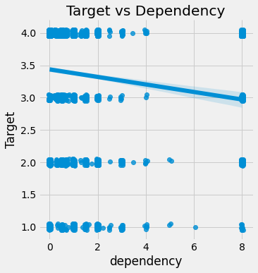
    


- 의존도가 증가할수록 타겟값은 감소\
    -> 더 많은 의존적인 가족 구성원을 갖는 것은 그들이 비의존적인 가족 구성원에 의해 부양되어야 하기 때문에 더 높은 수준의 빈곤을 초래한다


```python
sns.lmplot('rooms-per-capita', 'Target', fit_reg = True, data = train_heads, x_jitter=0.05, y_jitter=0.05);
plt.title('Target vs Rooms Per Capita');
```

    /Users/nahyunsong/opt/anaconda3/lib/python3.8/site-packages/seaborn/_decorators.py:36: FutureWarning: Pass the following variables as keyword args: x, y. From version 0.12, the only valid positional argument will be `data`, and passing other arguments without an explicit keyword will result in an error or misinterpretation.
      warnings.warn(


    
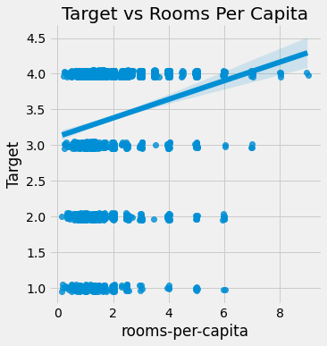
    


**Correlation Heatmap**


```python
#7개 column 사이의 상관관계를 히트맵으로 확인
variables = ['Target', 'dependency', 'warning', 'walls+roof+floor', 'meaneduc',
             'floor', 'r4m1', 'overcrowding']

# Calculate the correlations
corr_mat = train_heads[variables].corr().round(2)

# Draw a correlation heatmap
plt.rcParams['font.size'] = 18
plt.figure(figsize = (12, 12))
sns.heatmap(corr_mat, vmin = -0.5, vmax = 0.8, center = 0, 
            cmap = plt.cm.RdYlGn_r, annot = True);
```


    

    


**Features Plot**

가계 수준 데이터의 최종 탐색을 위해 목표값과 가장 상관 관계가 높은 변수 확인


```python
import warnings
warnings.filterwarnings('ignore')

# Copy the data for plotting
plot_data = train_heads[['Target', 'dependency', 'walls+roof+floor',
                         'meaneduc', 'overcrowding']]

# Create the pairgrid object
grid = sns.PairGrid(data = plot_data, size = 4, diag_sharey=False,
                    hue = 'Target', hue_order = [4, 3, 2, 1], 
                    vars = [x for x in list(plot_data.columns) if x != 'Target'])

# Upper is a scatter plot - 위쪽 삼각형 : 산점도
grid.map_upper(plt.scatter, alpha = 0.8, s = 20)

# Diagonal is a histogram - 대각선 : 커널 밀도 추정치
grid.map_diag(sns.kdeplot)

# Bottom is density plot - 아래쪽 삼각형 : 2D KDE플롯
grid.map_lower(sns.kdeplot, cmap = plt.cm.OrRd_r);
grid = grid.add_legend()
plt.suptitle('Feature Plots Colored By Target', size = 32, y = 1.05);
```


    
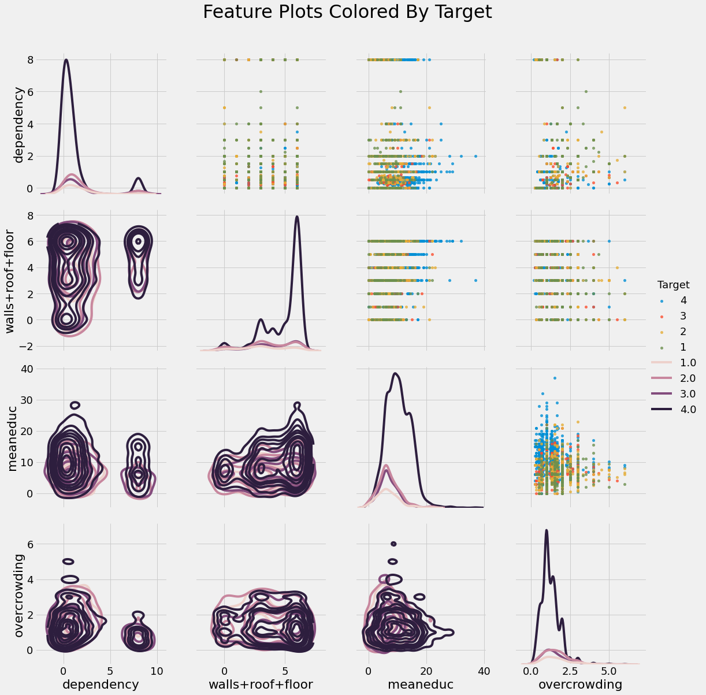
    


```python
household_feats = list(heads.columns)
```

# 4. Individual Level Variables

개별 수준 변수에는 두 가지 유형이 있다 - 부울, 순서형


```python
ind = data[id_ + ind_bool + ind_ordered]
ind.shape
```


    (33413, 40)


## - Redundant Individual Variables


```python
# 중복된 개별 변수를 식별하기 위해 상관 계수의 절대 크기가 0.95보다 큰 변수 확인
# Create correlation matrix
corr_matrix = ind.corr()

# Select upper triangle of correlation matrix
upper = corr_matrix.where(np.triu(np.ones(corr_matrix.shape), k=1).astype(np.bool))

# Find index of feature columns with correlation greater than 0.95
to_drop = [column for column in upper.columns if any(abs(upper[column]) > 0.95)]

to_drop
```


    ['female']


```python
ind = ind.drop(columns = 'male')
```

**Creating Ordinal Variables**


```python
#순서형 변수에 매핑하기 위해 각 개인에 대해 0이 아닌 열을 찾기
ind[[c for c in ind if c.startswith('instl')]].head()
```


<div>
<style scoped>
    .dataframe tbody tr th:only-of-type {
        vertical-align: middle;
    }

    .dataframe tbody tr th {
        vertical-align: top;
    }

    .dataframe thead th {
        text-align: right;
    }
</style>
<table border="1" class="dataframe">
  <thead>
    <tr style="text-align: right;">
      <th></th>
      <th>instlevel1</th>
      <th>instlevel2</th>
      <th>instlevel3</th>
      <th>instlevel4</th>
      <th>instlevel5</th>
      <th>instlevel6</th>
      <th>instlevel7</th>
      <th>instlevel8</th>
      <th>instlevel9</th>
    </tr>
  </thead>
  <tbody>
    <tr>
      <th>0</th>
      <td>0</td>
      <td>0</td>
      <td>0</td>
      <td>1</td>
      <td>0</td>
      <td>0</td>
      <td>0</td>
      <td>0</td>
      <td>0</td>
    </tr>
    <tr>
      <th>1</th>
      <td>0</td>
      <td>0</td>
      <td>0</td>
      <td>0</td>
      <td>0</td>
      <td>0</td>
      <td>0</td>
      <td>1</td>
      <td>0</td>
    </tr>
    <tr>
      <th>2</th>
      <td>0</td>
      <td>0</td>
      <td>0</td>
      <td>0</td>
      <td>1</td>
      <td>0</td>
      <td>0</td>
      <td>0</td>
      <td>0</td>
    </tr>
    <tr>
      <th>3</th>
      <td>0</td>
      <td>0</td>
      <td>0</td>
      <td>1</td>
      <td>0</td>
      <td>0</td>
      <td>0</td>
      <td>0</td>
      <td>0</td>
    </tr>
    <tr>
      <th>4</th>
      <td>0</td>
      <td>0</td>
      <td>0</td>
      <td>0</td>
      <td>1</td>
      <td>0</td>
      <td>0</td>
      <td>0</td>
      <td>0</td>
    </tr>
  </tbody>
</table>
</div>


```python
# Drop the education columns
# ind = ind.drop(columns = [c for c in ind if c.startswith('instlevel')])
ind.shape
```


    (33413, 40)


**Feature Construction**


```python
#학교생활의 연도를 나이에 따라 나눔
ind['escolari/age'] = ind['escolari'] / ind['age']

plt.figure(figsize = (10, 8))
sns.violinplot('Target', 'escolari/age', data = ind);
```


    
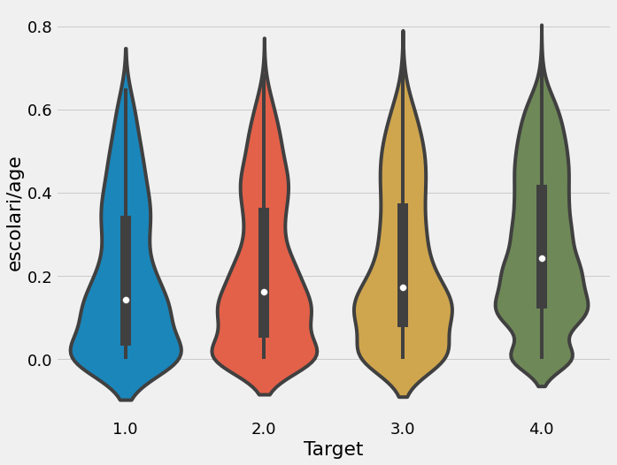
    


```python
ind['inst/age'] = ind['inst'] / ind['age']
ind['tech'] = ind['v18q'] + ind['mobilephone'] #태블릿과 휴대폰의 총 개수로 새로운 feature 생성
ind['tech'].describe()
```


    count    33413.000000
    mean         1.214886
    std          0.462567
    min          0.000000
    25%          1.000000
    50%          1.000000
    75%          1.000000
    max          2.000000
    Name: tech, dtype: float64


**Feature Engineering through Aggregations**

개별 데이터를 가계 데이터에 통합하기 위해 `idhogar` 패밀리를 `groupby`한 다음 데이터를 `agg`함


```python
# Define custom function
range_ = lambda x: x.max() - x.min()
range_.__name__ = 'range_'

# Group and aggregate
ind_agg = ind.drop(columns = 'Target').groupby('idhogar').agg(['min', 'max', 'sum', 'count', 'std', range_])
ind_agg.head()
```


<div>
<style scoped>
    .dataframe tbody tr th:only-of-type {
        vertical-align: middle;
    }

    .dataframe tbody tr th {
        vertical-align: top;
    }

    .dataframe thead tr th {
        text-align: left;
    }

    .dataframe thead tr:last-of-type th {
        text-align: right;
    }
</style>
<table border="1" class="dataframe">
  <thead>
    <tr>
      <th></th>
      <th colspan="6" halign="left">v18q</th>
      <th colspan="6" halign="left">dis</th>
      <th colspan="6" halign="left">female</th>
      <th colspan="6" halign="left">estadocivil1</th>
      <th colspan="6" halign="left">estadocivil2</th>
      <th colspan="6" halign="left">estadocivil3</th>
      <th colspan="6" halign="left">estadocivil4</th>
      <th colspan="6" halign="left">estadocivil5</th>
      <th colspan="6" halign="left">estadocivil6</th>
      <th colspan="6" halign="left">estadocivil7</th>
      <th colspan="6" halign="left">parentesco1</th>
      <th colspan="6" halign="left">parentesco2</th>
      <th colspan="3" halign="left">parentesco3</th>
      <th>...</th>
      <th colspan="3" halign="left">instlevel5</th>
      <th colspan="6" halign="left">instlevel6</th>
      <th colspan="6" halign="left">instlevel7</th>
      <th colspan="6" halign="left">instlevel8</th>
      <th colspan="6" halign="left">instlevel9</th>
      <th colspan="6" halign="left">mobilephone</th>
      <th colspan="6" halign="left">rez_esc</th>
      <th colspan="6" halign="left">escolari</th>
      <th colspan="6" halign="left">age</th>
      <th colspan="6" halign="left">inst</th>
      <th colspan="6" halign="left">escolari/age</th>
      <th colspan="6" halign="left">inst/age</th>
      <th colspan="6" halign="left">tech</th>
    </tr>
    <tr>
      <th></th>
      <th>min</th>
      <th>max</th>
      <th>sum</th>
      <th>count</th>
      <th>std</th>
      <th>range_</th>
      <th>min</th>
      <th>max</th>
      <th>sum</th>
      <th>count</th>
      <th>std</th>
      <th>range_</th>
      <th>min</th>
      <th>max</th>
      <th>sum</th>
      <th>count</th>
      <th>std</th>
      <th>range_</th>
      <th>min</th>
      <th>max</th>
      <th>sum</th>
      <th>count</th>
      <th>std</th>
      <th>range_</th>
      <th>min</th>
      <th>max</th>
      <th>sum</th>
      <th>count</th>
      <th>std</th>
      <th>range_</th>
      <th>min</th>
      <th>max</th>
      <th>sum</th>
      <th>count</th>
      <th>std</th>
      <th>range_</th>
      <th>min</th>
      <th>max</th>
      <th>sum</th>
      <th>count</th>
      <th>std</th>
      <th>range_</th>
      <th>min</th>
      <th>max</th>
      <th>sum</th>
      <th>count</th>
      <th>std</th>
      <th>range_</th>
      <th>min</th>
      <th>max</th>
      <th>sum</th>
      <th>count</th>
      <th>std</th>
      <th>range_</th>
      <th>min</th>
      <th>max</th>
      <th>sum</th>
      <th>count</th>
      <th>std</th>
      <th>range_</th>
      <th>min</th>
      <th>max</th>
      <th>sum</th>
      <th>count</th>
      <th>std</th>
      <th>range_</th>
      <th>min</th>
      <th>max</th>
      <th>sum</th>
      <th>count</th>
      <th>std</th>
      <th>range_</th>
      <th>min</th>
      <th>max</th>
      <th>sum</th>
      <th>...</th>
      <th>count</th>
      <th>std</th>
      <th>range_</th>
      <th>min</th>
      <th>max</th>
      <th>sum</th>
      <th>count</th>
      <th>std</th>
      <th>range_</th>
      <th>min</th>
      <th>max</th>
      <th>sum</th>
      <th>count</th>
      <th>std</th>
      <th>range_</th>
      <th>min</th>
      <th>max</th>
      <th>sum</th>
      <th>count</th>
      <th>std</th>
      <th>range_</th>
      <th>min</th>
      <th>max</th>
      <th>sum</th>
      <th>count</th>
      <th>std</th>
      <th>range_</th>
      <th>min</th>
      <th>max</th>
      <th>sum</th>
      <th>count</th>
      <th>std</th>
      <th>range_</th>
      <th>min</th>
      <th>max</th>
      <th>sum</th>
      <th>count</th>
      <th>std</th>
      <th>range_</th>
      <th>min</th>
      <th>max</th>
      <th>sum</th>
      <th>count</th>
      <th>std</th>
      <th>range_</th>
      <th>min</th>
      <th>max</th>
      <th>sum</th>
      <th>count</th>
      <th>std</th>
      <th>range_</th>
      <th>min</th>
      <th>max</th>
      <th>sum</th>
      <th>count</th>
      <th>std</th>
      <th>range_</th>
      <th>min</th>
      <th>max</th>
      <th>sum</th>
      <th>count</th>
      <th>std</th>
      <th>range_</th>
      <th>min</th>
      <th>max</th>
      <th>sum</th>
      <th>count</th>
      <th>std</th>
      <th>range_</th>
      <th>min</th>
      <th>max</th>
      <th>sum</th>
      <th>count</th>
      <th>std</th>
      <th>range_</th>
    </tr>
    <tr>
      <th>idhogar</th>
      <th></th>
      <th></th>
      <th></th>
      <th></th>
      <th></th>
      <th></th>
      <th></th>
      <th></th>
      <th></th>
      <th></th>
      <th></th>
      <th></th>
      <th></th>
      <th></th>
      <th></th>
      <th></th>
      <th></th>
      <th></th>
      <th></th>
      <th></th>
      <th></th>
      <th></th>
      <th></th>
      <th></th>
      <th></th>
      <th></th>
      <th></th>
      <th></th>
      <th></th>
      <th></th>
      <th></th>
      <th></th>
      <th></th>
      <th></th>
      <th></th>
      <th></th>
      <th></th>
      <th></th>
      <th></th>
      <th></th>
      <th></th>
      <th></th>
      <th></th>
      <th></th>
      <th></th>
      <th></th>
      <th></th>
      <th></th>
      <th></th>
      <th></th>
      <th></th>
      <th></th>
      <th></th>
      <th></th>
      <th></th>
      <th></th>
      <th></th>
      <th></th>
      <th></th>
      <th></th>
      <th></th>
      <th></th>
      <th></th>
      <th></th>
      <th></th>
      <th></th>
      <th></th>
      <th></th>
      <th></th>
      <th></th>
      <th></th>
      <th></th>
      <th></th>
      <th></th>
      <th></th>
      <th></th>
      <th></th>
      <th></th>
      <th></th>
      <th></th>
      <th></th>
      <th></th>
      <th></th>
      <th></th>
      <th></th>
      <th></th>
      <th></th>
      <th></th>
      <th></th>
      <th></th>
      <th></th>
      <th></th>
      <th></th>
      <th></th>
      <th></th>
      <th></th>
      <th></th>
      <th></th>
      <th></th>
      <th></th>
      <th></th>
      <th></th>
      <th></th>
      <th></th>
      <th></th>
      <th></th>
      <th></th>
      <th></th>
      <th></th>
      <th></th>
      <th></th>
      <th></th>
      <th></th>
      <th></th>
      <th></th>
      <th></th>
      <th></th>
      <th></th>
      <th></th>
      <th></th>
      <th></th>
      <th></th>
      <th></th>
      <th></th>
      <th></th>
      <th></th>
      <th></th>
      <th></th>
      <th></th>
      <th></th>
      <th></th>
      <th></th>
      <th></th>
      <th></th>
      <th></th>
      <th></th>
      <th></th>
      <th></th>
      <th></th>
      <th></th>
      <th></th>
      <th></th>
      <th></th>
      <th></th>
      <th></th>
      <th></th>
      <th></th>
      <th></th>
      <th></th>
      <th></th>
      <th></th>
    </tr>
  </thead>
  <tbody>
    <tr>
      <th>000a08204</th>
      <td>1</td>
      <td>1</td>
      <td>3</td>
      <td>3</td>
      <td>0.0</td>
      <td>0</td>
      <td>0</td>
      <td>0</td>
      <td>0</td>
      <td>3</td>
      <td>0.000000</td>
      <td>0</td>
      <td>0</td>
      <td>1</td>
      <td>1</td>
      <td>3</td>
      <td>0.577350</td>
      <td>1</td>
      <td>0</td>
      <td>1</td>
      <td>1</td>
      <td>3</td>
      <td>0.577350</td>
      <td>1</td>
      <td>0</td>
      <td>1</td>
      <td>2</td>
      <td>3</td>
      <td>0.57735</td>
      <td>1</td>
      <td>0</td>
      <td>0</td>
      <td>0</td>
      <td>3</td>
      <td>0.0</td>
      <td>0</td>
      <td>0</td>
      <td>0</td>
      <td>0</td>
      <td>3</td>
      <td>0.0</td>
      <td>0</td>
      <td>0</td>
      <td>0</td>
      <td>0</td>
      <td>3</td>
      <td>0.000000</td>
      <td>0</td>
      <td>0</td>
      <td>0</td>
      <td>0</td>
      <td>3</td>
      <td>0.0</td>
      <td>0</td>
      <td>0</td>
      <td>0</td>
      <td>0</td>
      <td>3</td>
      <td>0.00000</td>
      <td>0</td>
      <td>0</td>
      <td>1</td>
      <td>1</td>
      <td>3</td>
      <td>0.577350</td>
      <td>1</td>
      <td>0</td>
      <td>1</td>
      <td>1</td>
      <td>3</td>
      <td>0.577350</td>
      <td>1</td>
      <td>0</td>
      <td>1</td>
      <td>1</td>
      <td>...</td>
      <td>3</td>
      <td>0.0</td>
      <td>0</td>
      <td>0</td>
      <td>0</td>
      <td>0</td>
      <td>3</td>
      <td>0.0</td>
      <td>0</td>
      <td>0</td>
      <td>0</td>
      <td>0</td>
      <td>3</td>
      <td>0.0</td>
      <td>0</td>
      <td>0</td>
      <td>1</td>
      <td>2</td>
      <td>3</td>
      <td>0.577350</td>
      <td>1</td>
      <td>0</td>
      <td>0</td>
      <td>0</td>
      <td>3</td>
      <td>0.0</td>
      <td>0</td>
      <td>1</td>
      <td>1</td>
      <td>3</td>
      <td>3</td>
      <td>0.0</td>
      <td>0</td>
      <td>0.0</td>
      <td>0.0</td>
      <td>0.0</td>
      <td>3</td>
      <td>0.0</td>
      <td>0.0</td>
      <td>0</td>
      <td>14</td>
      <td>26</td>
      <td>3</td>
      <td>7.571878</td>
      <td>14</td>
      <td>4</td>
      <td>30</td>
      <td>62</td>
      <td>3</td>
      <td>14.468356</td>
      <td>26</td>
      <td>0</td>
      <td>7</td>
      <td>14</td>
      <td>3</td>
      <td>4.041452</td>
      <td>7</td>
      <td>0.000000</td>
      <td>0.500000</td>
      <td>0.900000</td>
      <td>3</td>
      <td>0.264575</td>
      <td>0.500000</td>
      <td>0.000000</td>
      <td>0.250000</td>
      <td>0.483333</td>
      <td>3</td>
      <td>0.139775</td>
      <td>0.250000</td>
      <td>2</td>
      <td>2</td>
      <td>6</td>
      <td>3</td>
      <td>0.0</td>
      <td>0</td>
    </tr>
    <tr>
      <th>000bce7c4</th>
      <td>0</td>
      <td>0</td>
      <td>0</td>
      <td>2</td>
      <td>0.0</td>
      <td>0</td>
      <td>0</td>
      <td>1</td>
      <td>1</td>
      <td>2</td>
      <td>0.707107</td>
      <td>1</td>
      <td>0</td>
      <td>1</td>
      <td>1</td>
      <td>2</td>
      <td>0.707107</td>
      <td>1</td>
      <td>0</td>
      <td>0</td>
      <td>0</td>
      <td>2</td>
      <td>0.000000</td>
      <td>0</td>
      <td>0</td>
      <td>0</td>
      <td>0</td>
      <td>2</td>
      <td>0.00000</td>
      <td>0</td>
      <td>1</td>
      <td>1</td>
      <td>2</td>
      <td>2</td>
      <td>0.0</td>
      <td>0</td>
      <td>0</td>
      <td>0</td>
      <td>0</td>
      <td>2</td>
      <td>0.0</td>
      <td>0</td>
      <td>0</td>
      <td>0</td>
      <td>0</td>
      <td>2</td>
      <td>0.000000</td>
      <td>0</td>
      <td>0</td>
      <td>0</td>
      <td>0</td>
      <td>2</td>
      <td>0.0</td>
      <td>0</td>
      <td>0</td>
      <td>0</td>
      <td>0</td>
      <td>2</td>
      <td>0.00000</td>
      <td>0</td>
      <td>0</td>
      <td>1</td>
      <td>1</td>
      <td>2</td>
      <td>0.707107</td>
      <td>1</td>
      <td>0</td>
      <td>1</td>
      <td>1</td>
      <td>2</td>
      <td>0.707107</td>
      <td>1</td>
      <td>0</td>
      <td>0</td>
      <td>0</td>
      <td>...</td>
      <td>2</td>
      <td>0.0</td>
      <td>0</td>
      <td>0</td>
      <td>0</td>
      <td>0</td>
      <td>2</td>
      <td>0.0</td>
      <td>0</td>
      <td>0</td>
      <td>0</td>
      <td>0</td>
      <td>2</td>
      <td>0.0</td>
      <td>0</td>
      <td>0</td>
      <td>0</td>
      <td>0</td>
      <td>2</td>
      <td>0.000000</td>
      <td>0</td>
      <td>0</td>
      <td>0</td>
      <td>0</td>
      <td>2</td>
      <td>0.0</td>
      <td>0</td>
      <td>1</td>
      <td>1</td>
      <td>2</td>
      <td>2</td>
      <td>0.0</td>
      <td>0</td>
      <td>0.0</td>
      <td>0.0</td>
      <td>0.0</td>
      <td>2</td>
      <td>0.0</td>
      <td>0.0</td>
      <td>0</td>
      <td>5</td>
      <td>5</td>
      <td>2</td>
      <td>3.535534</td>
      <td>5</td>
      <td>60</td>
      <td>63</td>
      <td>123</td>
      <td>2</td>
      <td>2.121320</td>
      <td>3</td>
      <td>0</td>
      <td>1</td>
      <td>1</td>
      <td>2</td>
      <td>0.707107</td>
      <td>1</td>
      <td>0.000000</td>
      <td>0.083333</td>
      <td>0.083333</td>
      <td>2</td>
      <td>0.058926</td>
      <td>0.083333</td>
      <td>0.000000</td>
      <td>0.016667</td>
      <td>0.016667</td>
      <td>2</td>
      <td>0.011785</td>
      <td>0.016667</td>
      <td>1</td>
      <td>1</td>
      <td>2</td>
      <td>2</td>
      <td>0.0</td>
      <td>0</td>
    </tr>
    <tr>
      <th>001845fb0</th>
      <td>0</td>
      <td>0</td>
      <td>0</td>
      <td>4</td>
      <td>0.0</td>
      <td>0</td>
      <td>0</td>
      <td>0</td>
      <td>0</td>
      <td>4</td>
      <td>0.000000</td>
      <td>0</td>
      <td>0</td>
      <td>1</td>
      <td>2</td>
      <td>4</td>
      <td>0.577350</td>
      <td>1</td>
      <td>0</td>
      <td>0</td>
      <td>0</td>
      <td>4</td>
      <td>0.000000</td>
      <td>0</td>
      <td>0</td>
      <td>1</td>
      <td>2</td>
      <td>4</td>
      <td>0.57735</td>
      <td>1</td>
      <td>0</td>
      <td>0</td>
      <td>0</td>
      <td>4</td>
      <td>0.0</td>
      <td>0</td>
      <td>0</td>
      <td>0</td>
      <td>0</td>
      <td>4</td>
      <td>0.0</td>
      <td>0</td>
      <td>0</td>
      <td>0</td>
      <td>0</td>
      <td>4</td>
      <td>0.000000</td>
      <td>0</td>
      <td>0</td>
      <td>0</td>
      <td>0</td>
      <td>4</td>
      <td>0.0</td>
      <td>0</td>
      <td>0</td>
      <td>1</td>
      <td>2</td>
      <td>4</td>
      <td>0.57735</td>
      <td>1</td>
      <td>0</td>
      <td>1</td>
      <td>1</td>
      <td>4</td>
      <td>0.500000</td>
      <td>1</td>
      <td>0</td>
      <td>1</td>
      <td>1</td>
      <td>4</td>
      <td>0.500000</td>
      <td>1</td>
      <td>0</td>
      <td>1</td>
      <td>2</td>
      <td>...</td>
      <td>4</td>
      <td>0.5</td>
      <td>1</td>
      <td>0</td>
      <td>0</td>
      <td>0</td>
      <td>4</td>
      <td>0.0</td>
      <td>0</td>
      <td>0</td>
      <td>0</td>
      <td>0</td>
      <td>4</td>
      <td>0.0</td>
      <td>0</td>
      <td>0</td>
      <td>1</td>
      <td>1</td>
      <td>4</td>
      <td>0.500000</td>
      <td>1</td>
      <td>0</td>
      <td>0</td>
      <td>0</td>
      <td>4</td>
      <td>0.0</td>
      <td>0</td>
      <td>1</td>
      <td>1</td>
      <td>4</td>
      <td>4</td>
      <td>0.0</td>
      <td>0</td>
      <td>0.0</td>
      <td>0.0</td>
      <td>0.0</td>
      <td>3</td>
      <td>0.0</td>
      <td>0.0</td>
      <td>6</td>
      <td>14</td>
      <td>41</td>
      <td>4</td>
      <td>3.304038</td>
      <td>8</td>
      <td>19</td>
      <td>52</td>
      <td>142</td>
      <td>4</td>
      <td>16.421531</td>
      <td>33</td>
      <td>2</td>
      <td>7</td>
      <td>16</td>
      <td>4</td>
      <td>2.160247</td>
      <td>5</td>
      <td>0.115385</td>
      <td>0.526316</td>
      <td>1.397906</td>
      <td>4</td>
      <td>0.183106</td>
      <td>0.410931</td>
      <td>0.038462</td>
      <td>0.166667</td>
      <td>0.511959</td>
      <td>4</td>
      <td>0.060123</td>
      <td>0.128205</td>
      <td>1</td>
      <td>1</td>
      <td>4</td>
      <td>4</td>
      <td>0.0</td>
      <td>0</td>
    </tr>
    <tr>
      <th>001ff74ca</th>
      <td>1</td>
      <td>1</td>
      <td>2</td>
      <td>2</td>
      <td>0.0</td>
      <td>0</td>
      <td>0</td>
      <td>0</td>
      <td>0</td>
      <td>2</td>
      <td>0.000000</td>
      <td>0</td>
      <td>1</td>
      <td>1</td>
      <td>2</td>
      <td>2</td>
      <td>0.000000</td>
      <td>0</td>
      <td>0</td>
      <td>1</td>
      <td>1</td>
      <td>2</td>
      <td>0.707107</td>
      <td>1</td>
      <td>0</td>
      <td>0</td>
      <td>0</td>
      <td>2</td>
      <td>0.00000</td>
      <td>0</td>
      <td>0</td>
      <td>0</td>
      <td>0</td>
      <td>2</td>
      <td>0.0</td>
      <td>0</td>
      <td>0</td>
      <td>0</td>
      <td>0</td>
      <td>2</td>
      <td>0.0</td>
      <td>0</td>
      <td>0</td>
      <td>1</td>
      <td>1</td>
      <td>2</td>
      <td>0.707107</td>
      <td>1</td>
      <td>0</td>
      <td>0</td>
      <td>0</td>
      <td>2</td>
      <td>0.0</td>
      <td>0</td>
      <td>0</td>
      <td>0</td>
      <td>0</td>
      <td>2</td>
      <td>0.00000</td>
      <td>0</td>
      <td>0</td>
      <td>1</td>
      <td>1</td>
      <td>2</td>
      <td>0.707107</td>
      <td>1</td>
      <td>0</td>
      <td>0</td>
      <td>0</td>
      <td>2</td>
      <td>0.000000</td>
      <td>0</td>
      <td>0</td>
      <td>1</td>
      <td>1</td>
      <td>...</td>
      <td>2</td>
      <td>0.0</td>
      <td>0</td>
      <td>0</td>
      <td>0</td>
      <td>0</td>
      <td>2</td>
      <td>0.0</td>
      <td>0</td>
      <td>0</td>
      <td>0</td>
      <td>0</td>
      <td>2</td>
      <td>0.0</td>
      <td>0</td>
      <td>0</td>
      <td>1</td>
      <td>1</td>
      <td>2</td>
      <td>0.707107</td>
      <td>1</td>
      <td>0</td>
      <td>0</td>
      <td>0</td>
      <td>2</td>
      <td>0.0</td>
      <td>0</td>
      <td>1</td>
      <td>1</td>
      <td>2</td>
      <td>2</td>
      <td>0.0</td>
      <td>0</td>
      <td>0.0</td>
      <td>0.0</td>
      <td>0.0</td>
      <td>2</td>
      <td>0.0</td>
      <td>0.0</td>
      <td>0</td>
      <td>16</td>
      <td>16</td>
      <td>2</td>
      <td>11.313708</td>
      <td>16</td>
      <td>0</td>
      <td>38</td>
      <td>38</td>
      <td>2</td>
      <td>26.870058</td>
      <td>38</td>
      <td>0</td>
      <td>7</td>
      <td>7</td>
      <td>2</td>
      <td>4.949747</td>
      <td>7</td>
      <td>0.421053</td>
      <td>0.421053</td>
      <td>0.421053</td>
      <td>1</td>
      <td>NaN</td>
      <td>0.000000</td>
      <td>0.184211</td>
      <td>0.184211</td>
      <td>0.184211</td>
      <td>1</td>
      <td>NaN</td>
      <td>0.000000</td>
      <td>2</td>
      <td>2</td>
      <td>4</td>
      <td>2</td>
      <td>0.0</td>
      <td>0</td>
    </tr>
    <tr>
      <th>003123ec2</th>
      <td>0</td>
      <td>0</td>
      <td>0</td>
      <td>4</td>
      <td>0.0</td>
      <td>0</td>
      <td>0</td>
      <td>0</td>
      <td>0</td>
      <td>4</td>
      <td>0.000000</td>
      <td>0</td>
      <td>0</td>
      <td>1</td>
      <td>1</td>
      <td>4</td>
      <td>0.500000</td>
      <td>1</td>
      <td>0</td>
      <td>1</td>
      <td>2</td>
      <td>4</td>
      <td>0.577350</td>
      <td>1</td>
      <td>0</td>
      <td>1</td>
      <td>2</td>
      <td>4</td>
      <td>0.57735</td>
      <td>1</td>
      <td>0</td>
      <td>0</td>
      <td>0</td>
      <td>4</td>
      <td>0.0</td>
      <td>0</td>
      <td>0</td>
      <td>0</td>
      <td>0</td>
      <td>4</td>
      <td>0.0</td>
      <td>0</td>
      <td>0</td>
      <td>0</td>
      <td>0</td>
      <td>4</td>
      <td>0.000000</td>
      <td>0</td>
      <td>0</td>
      <td>0</td>
      <td>0</td>
      <td>4</td>
      <td>0.0</td>
      <td>0</td>
      <td>0</td>
      <td>0</td>
      <td>0</td>
      <td>4</td>
      <td>0.00000</td>
      <td>0</td>
      <td>0</td>
      <td>1</td>
      <td>1</td>
      <td>4</td>
      <td>0.500000</td>
      <td>1</td>
      <td>0</td>
      <td>1</td>
      <td>1</td>
      <td>4</td>
      <td>0.500000</td>
      <td>1</td>
      <td>0</td>
      <td>1</td>
      <td>2</td>
      <td>...</td>
      <td>4</td>
      <td>0.0</td>
      <td>0</td>
      <td>0</td>
      <td>0</td>
      <td>0</td>
      <td>4</td>
      <td>0.0</td>
      <td>0</td>
      <td>0</td>
      <td>0</td>
      <td>0</td>
      <td>4</td>
      <td>0.0</td>
      <td>0</td>
      <td>0</td>
      <td>0</td>
      <td>0</td>
      <td>4</td>
      <td>0.000000</td>
      <td>0</td>
      <td>0</td>
      <td>0</td>
      <td>0</td>
      <td>4</td>
      <td>0.0</td>
      <td>0</td>
      <td>1</td>
      <td>1</td>
      <td>4</td>
      <td>4</td>
      <td>0.0</td>
      <td>0</td>
      <td>0.0</td>
      <td>0.0</td>
      <td>0.0</td>
      <td>4</td>
      <td>0.0</td>
      <td>0.0</td>
      <td>0</td>
      <td>7</td>
      <td>13</td>
      <td>4</td>
      <td>3.774917</td>
      <td>7</td>
      <td>1</td>
      <td>24</td>
      <td>51</td>
      <td>4</td>
      <td>12.446552</td>
      <td>23</td>
      <td>0</td>
      <td>3</td>
      <td>5</td>
      <td>4</td>
      <td>1.500000</td>
      <td>3</td>
      <td>0.000000</td>
      <td>0.304348</td>
      <td>0.554348</td>
      <td>4</td>
      <td>0.161557</td>
      <td>0.304348</td>
      <td>0.000000</td>
      <td>0.130435</td>
      <td>0.213768</td>
      <td>4</td>
      <td>0.064636</td>
      <td>0.130435</td>
      <td>1</td>
      <td>1</td>
      <td>4</td>
      <td>4</td>
      <td>0.0</td>
      <td>0</td>
    </tr>
  </tbody>
</table>
<p>5 rows × 234 columns</p>
</div>


```python
# 컴럼명 변경
new_col = []
for c in ind_agg.columns.levels[0]:
    for stat in ind_agg.columns.levels[1]:
        new_col.append(f'{c}-{stat}')
        
ind_agg.columns = new_col
ind_agg.head()
```


<div>
<style scoped>
    .dataframe tbody tr th:only-of-type {
        vertical-align: middle;
    }

    .dataframe tbody tr th {
        vertical-align: top;
    }

    .dataframe thead th {
        text-align: right;
    }
</style>
<table border="1" class="dataframe">
  <thead>
    <tr style="text-align: right;">
      <th></th>
      <th>v18q-min</th>
      <th>v18q-max</th>
      <th>v18q-sum</th>
      <th>v18q-count</th>
      <th>v18q-std</th>
      <th>v18q-range_</th>
      <th>dis-min</th>
      <th>dis-max</th>
      <th>dis-sum</th>
      <th>dis-count</th>
      <th>dis-std</th>
      <th>dis-range_</th>
      <th>female-min</th>
      <th>female-max</th>
      <th>female-sum</th>
      <th>female-count</th>
      <th>female-std</th>
      <th>female-range_</th>
      <th>estadocivil1-min</th>
      <th>estadocivil1-max</th>
      <th>estadocivil1-sum</th>
      <th>estadocivil1-count</th>
      <th>estadocivil1-std</th>
      <th>estadocivil1-range_</th>
      <th>estadocivil2-min</th>
      <th>estadocivil2-max</th>
      <th>estadocivil2-sum</th>
      <th>estadocivil2-count</th>
      <th>estadocivil2-std</th>
      <th>estadocivil2-range_</th>
      <th>estadocivil3-min</th>
      <th>estadocivil3-max</th>
      <th>estadocivil3-sum</th>
      <th>estadocivil3-count</th>
      <th>estadocivil3-std</th>
      <th>estadocivil3-range_</th>
      <th>estadocivil4-min</th>
      <th>estadocivil4-max</th>
      <th>estadocivil4-sum</th>
      <th>estadocivil4-count</th>
      <th>estadocivil4-std</th>
      <th>estadocivil4-range_</th>
      <th>estadocivil5-min</th>
      <th>estadocivil5-max</th>
      <th>estadocivil5-sum</th>
      <th>estadocivil5-count</th>
      <th>estadocivil5-std</th>
      <th>estadocivil5-range_</th>
      <th>estadocivil6-min</th>
      <th>estadocivil6-max</th>
      <th>estadocivil6-sum</th>
      <th>estadocivil6-count</th>
      <th>estadocivil6-std</th>
      <th>estadocivil6-range_</th>
      <th>estadocivil7-min</th>
      <th>estadocivil7-max</th>
      <th>estadocivil7-sum</th>
      <th>estadocivil7-count</th>
      <th>estadocivil7-std</th>
      <th>estadocivil7-range_</th>
      <th>parentesco1-min</th>
      <th>parentesco1-max</th>
      <th>parentesco1-sum</th>
      <th>parentesco1-count</th>
      <th>parentesco1-std</th>
      <th>parentesco1-range_</th>
      <th>parentesco2-min</th>
      <th>parentesco2-max</th>
      <th>parentesco2-sum</th>
      <th>parentesco2-count</th>
      <th>parentesco2-std</th>
      <th>parentesco2-range_</th>
      <th>parentesco3-min</th>
      <th>parentesco3-max</th>
      <th>parentesco3-sum</th>
      <th>...</th>
      <th>instlevel5-count</th>
      <th>instlevel5-std</th>
      <th>instlevel5-range_</th>
      <th>instlevel6-min</th>
      <th>instlevel6-max</th>
      <th>instlevel6-sum</th>
      <th>instlevel6-count</th>
      <th>instlevel6-std</th>
      <th>instlevel6-range_</th>
      <th>instlevel7-min</th>
      <th>instlevel7-max</th>
      <th>instlevel7-sum</th>
      <th>instlevel7-count</th>
      <th>instlevel7-std</th>
      <th>instlevel7-range_</th>
      <th>instlevel8-min</th>
      <th>instlevel8-max</th>
      <th>instlevel8-sum</th>
      <th>instlevel8-count</th>
      <th>instlevel8-std</th>
      <th>instlevel8-range_</th>
      <th>instlevel9-min</th>
      <th>instlevel9-max</th>
      <th>instlevel9-sum</th>
      <th>instlevel9-count</th>
      <th>instlevel9-std</th>
      <th>instlevel9-range_</th>
      <th>mobilephone-min</th>
      <th>mobilephone-max</th>
      <th>mobilephone-sum</th>
      <th>mobilephone-count</th>
      <th>mobilephone-std</th>
      <th>mobilephone-range_</th>
      <th>rez_esc-min</th>
      <th>rez_esc-max</th>
      <th>rez_esc-sum</th>
      <th>rez_esc-count</th>
      <th>rez_esc-std</th>
      <th>rez_esc-range_</th>
      <th>escolari-min</th>
      <th>escolari-max</th>
      <th>escolari-sum</th>
      <th>escolari-count</th>
      <th>escolari-std</th>
      <th>escolari-range_</th>
      <th>age-min</th>
      <th>age-max</th>
      <th>age-sum</th>
      <th>age-count</th>
      <th>age-std</th>
      <th>age-range_</th>
      <th>inst-min</th>
      <th>inst-max</th>
      <th>inst-sum</th>
      <th>inst-count</th>
      <th>inst-std</th>
      <th>inst-range_</th>
      <th>escolari/age-min</th>
      <th>escolari/age-max</th>
      <th>escolari/age-sum</th>
      <th>escolari/age-count</th>
      <th>escolari/age-std</th>
      <th>escolari/age-range_</th>
      <th>inst/age-min</th>
      <th>inst/age-max</th>
      <th>inst/age-sum</th>
      <th>inst/age-count</th>
      <th>inst/age-std</th>
      <th>inst/age-range_</th>
      <th>tech-min</th>
      <th>tech-max</th>
      <th>tech-sum</th>
      <th>tech-count</th>
      <th>tech-std</th>
      <th>tech-range_</th>
    </tr>
    <tr>
      <th>idhogar</th>
      <th></th>
      <th></th>
      <th></th>
      <th></th>
      <th></th>
      <th></th>
      <th></th>
      <th></th>
      <th></th>
      <th></th>
      <th></th>
      <th></th>
      <th></th>
      <th></th>
      <th></th>
      <th></th>
      <th></th>
      <th></th>
      <th></th>
      <th></th>
      <th></th>
      <th></th>
      <th></th>
      <th></th>
      <th></th>
      <th></th>
      <th></th>
      <th></th>
      <th></th>
      <th></th>
      <th></th>
      <th></th>
      <th></th>
      <th></th>
      <th></th>
      <th></th>
      <th></th>
      <th></th>
      <th></th>
      <th></th>
      <th></th>
      <th></th>
      <th></th>
      <th></th>
      <th></th>
      <th></th>
      <th></th>
      <th></th>
      <th></th>
      <th></th>
      <th></th>
      <th></th>
      <th></th>
      <th></th>
      <th></th>
      <th></th>
      <th></th>
      <th></th>
      <th></th>
      <th></th>
      <th></th>
      <th></th>
      <th></th>
      <th></th>
      <th></th>
      <th></th>
      <th></th>
      <th></th>
      <th></th>
      <th></th>
      <th></th>
      <th></th>
      <th></th>
      <th></th>
      <th></th>
      <th></th>
      <th></th>
      <th></th>
      <th></th>
      <th></th>
      <th></th>
      <th></th>
      <th></th>
      <th></th>
      <th></th>
      <th></th>
      <th></th>
      <th></th>
      <th></th>
      <th></th>
      <th></th>
      <th></th>
      <th></th>
      <th></th>
      <th></th>
      <th></th>
      <th></th>
      <th></th>
      <th></th>
      <th></th>
      <th></th>
      <th></th>
      <th></th>
      <th></th>
      <th></th>
      <th></th>
      <th></th>
      <th></th>
      <th></th>
      <th></th>
      <th></th>
      <th></th>
      <th></th>
      <th></th>
      <th></th>
      <th></th>
      <th></th>
      <th></th>
      <th></th>
      <th></th>
      <th></th>
      <th></th>
      <th></th>
      <th></th>
      <th></th>
      <th></th>
      <th></th>
      <th></th>
      <th></th>
      <th></th>
      <th></th>
      <th></th>
      <th></th>
      <th></th>
      <th></th>
      <th></th>
      <th></th>
      <th></th>
      <th></th>
      <th></th>
      <th></th>
      <th></th>
      <th></th>
      <th></th>
      <th></th>
      <th></th>
      <th></th>
      <th></th>
      <th></th>
      <th></th>
      <th></th>
    </tr>
  </thead>
  <tbody>
    <tr>
      <th>000a08204</th>
      <td>1</td>
      <td>1</td>
      <td>3</td>
      <td>3</td>
      <td>0.0</td>
      <td>0</td>
      <td>0</td>
      <td>0</td>
      <td>0</td>
      <td>3</td>
      <td>0.000000</td>
      <td>0</td>
      <td>0</td>
      <td>1</td>
      <td>1</td>
      <td>3</td>
      <td>0.577350</td>
      <td>1</td>
      <td>0</td>
      <td>1</td>
      <td>1</td>
      <td>3</td>
      <td>0.577350</td>
      <td>1</td>
      <td>0</td>
      <td>1</td>
      <td>2</td>
      <td>3</td>
      <td>0.57735</td>
      <td>1</td>
      <td>0</td>
      <td>0</td>
      <td>0</td>
      <td>3</td>
      <td>0.0</td>
      <td>0</td>
      <td>0</td>
      <td>0</td>
      <td>0</td>
      <td>3</td>
      <td>0.0</td>
      <td>0</td>
      <td>0</td>
      <td>0</td>
      <td>0</td>
      <td>3</td>
      <td>0.000000</td>
      <td>0</td>
      <td>0</td>
      <td>0</td>
      <td>0</td>
      <td>3</td>
      <td>0.0</td>
      <td>0</td>
      <td>0</td>
      <td>0</td>
      <td>0</td>
      <td>3</td>
      <td>0.00000</td>
      <td>0</td>
      <td>0</td>
      <td>1</td>
      <td>1</td>
      <td>3</td>
      <td>0.577350</td>
      <td>1</td>
      <td>0</td>
      <td>1</td>
      <td>1</td>
      <td>3</td>
      <td>0.577350</td>
      <td>1</td>
      <td>0</td>
      <td>1</td>
      <td>1</td>
      <td>...</td>
      <td>3</td>
      <td>0.0</td>
      <td>0</td>
      <td>0</td>
      <td>0</td>
      <td>0</td>
      <td>3</td>
      <td>0.0</td>
      <td>0</td>
      <td>0</td>
      <td>0</td>
      <td>0</td>
      <td>3</td>
      <td>0.0</td>
      <td>0</td>
      <td>0</td>
      <td>1</td>
      <td>2</td>
      <td>3</td>
      <td>0.577350</td>
      <td>1</td>
      <td>0</td>
      <td>0</td>
      <td>0</td>
      <td>3</td>
      <td>0.0</td>
      <td>0</td>
      <td>1</td>
      <td>1</td>
      <td>3</td>
      <td>3</td>
      <td>0.0</td>
      <td>0</td>
      <td>0.0</td>
      <td>0.0</td>
      <td>0.0</td>
      <td>3</td>
      <td>0.0</td>
      <td>0.0</td>
      <td>0</td>
      <td>14</td>
      <td>26</td>
      <td>3</td>
      <td>7.571878</td>
      <td>14</td>
      <td>4</td>
      <td>30</td>
      <td>62</td>
      <td>3</td>
      <td>14.468356</td>
      <td>26</td>
      <td>0</td>
      <td>7</td>
      <td>14</td>
      <td>3</td>
      <td>4.041452</td>
      <td>7</td>
      <td>0.000000</td>
      <td>0.500000</td>
      <td>0.900000</td>
      <td>3</td>
      <td>0.264575</td>
      <td>0.500000</td>
      <td>0.000000</td>
      <td>0.250000</td>
      <td>0.483333</td>
      <td>3</td>
      <td>0.139775</td>
      <td>0.250000</td>
      <td>2</td>
      <td>2</td>
      <td>6</td>
      <td>3</td>
      <td>0.0</td>
      <td>0</td>
    </tr>
    <tr>
      <th>000bce7c4</th>
      <td>0</td>
      <td>0</td>
      <td>0</td>
      <td>2</td>
      <td>0.0</td>
      <td>0</td>
      <td>0</td>
      <td>1</td>
      <td>1</td>
      <td>2</td>
      <td>0.707107</td>
      <td>1</td>
      <td>0</td>
      <td>1</td>
      <td>1</td>
      <td>2</td>
      <td>0.707107</td>
      <td>1</td>
      <td>0</td>
      <td>0</td>
      <td>0</td>
      <td>2</td>
      <td>0.000000</td>
      <td>0</td>
      <td>0</td>
      <td>0</td>
      <td>0</td>
      <td>2</td>
      <td>0.00000</td>
      <td>0</td>
      <td>1</td>
      <td>1</td>
      <td>2</td>
      <td>2</td>
      <td>0.0</td>
      <td>0</td>
      <td>0</td>
      <td>0</td>
      <td>0</td>
      <td>2</td>
      <td>0.0</td>
      <td>0</td>
      <td>0</td>
      <td>0</td>
      <td>0</td>
      <td>2</td>
      <td>0.000000</td>
      <td>0</td>
      <td>0</td>
      <td>0</td>
      <td>0</td>
      <td>2</td>
      <td>0.0</td>
      <td>0</td>
      <td>0</td>
      <td>0</td>
      <td>0</td>
      <td>2</td>
      <td>0.00000</td>
      <td>0</td>
      <td>0</td>
      <td>1</td>
      <td>1</td>
      <td>2</td>
      <td>0.707107</td>
      <td>1</td>
      <td>0</td>
      <td>1</td>
      <td>1</td>
      <td>2</td>
      <td>0.707107</td>
      <td>1</td>
      <td>0</td>
      <td>0</td>
      <td>0</td>
      <td>...</td>
      <td>2</td>
      <td>0.0</td>
      <td>0</td>
      <td>0</td>
      <td>0</td>
      <td>0</td>
      <td>2</td>
      <td>0.0</td>
      <td>0</td>
      <td>0</td>
      <td>0</td>
      <td>0</td>
      <td>2</td>
      <td>0.0</td>
      <td>0</td>
      <td>0</td>
      <td>0</td>
      <td>0</td>
      <td>2</td>
      <td>0.000000</td>
      <td>0</td>
      <td>0</td>
      <td>0</td>
      <td>0</td>
      <td>2</td>
      <td>0.0</td>
      <td>0</td>
      <td>1</td>
      <td>1</td>
      <td>2</td>
      <td>2</td>
      <td>0.0</td>
      <td>0</td>
      <td>0.0</td>
      <td>0.0</td>
      <td>0.0</td>
      <td>2</td>
      <td>0.0</td>
      <td>0.0</td>
      <td>0</td>
      <td>5</td>
      <td>5</td>
      <td>2</td>
      <td>3.535534</td>
      <td>5</td>
      <td>60</td>
      <td>63</td>
      <td>123</td>
      <td>2</td>
      <td>2.121320</td>
      <td>3</td>
      <td>0</td>
      <td>1</td>
      <td>1</td>
      <td>2</td>
      <td>0.707107</td>
      <td>1</td>
      <td>0.000000</td>
      <td>0.083333</td>
      <td>0.083333</td>
      <td>2</td>
      <td>0.058926</td>
      <td>0.083333</td>
      <td>0.000000</td>
      <td>0.016667</td>
      <td>0.016667</td>
      <td>2</td>
      <td>0.011785</td>
      <td>0.016667</td>
      <td>1</td>
      <td>1</td>
      <td>2</td>
      <td>2</td>
      <td>0.0</td>
      <td>0</td>
    </tr>
    <tr>
      <th>001845fb0</th>
      <td>0</td>
      <td>0</td>
      <td>0</td>
      <td>4</td>
      <td>0.0</td>
      <td>0</td>
      <td>0</td>
      <td>0</td>
      <td>0</td>
      <td>4</td>
      <td>0.000000</td>
      <td>0</td>
      <td>0</td>
      <td>1</td>
      <td>2</td>
      <td>4</td>
      <td>0.577350</td>
      <td>1</td>
      <td>0</td>
      <td>0</td>
      <td>0</td>
      <td>4</td>
      <td>0.000000</td>
      <td>0</td>
      <td>0</td>
      <td>1</td>
      <td>2</td>
      <td>4</td>
      <td>0.57735</td>
      <td>1</td>
      <td>0</td>
      <td>0</td>
      <td>0</td>
      <td>4</td>
      <td>0.0</td>
      <td>0</td>
      <td>0</td>
      <td>0</td>
      <td>0</td>
      <td>4</td>
      <td>0.0</td>
      <td>0</td>
      <td>0</td>
      <td>0</td>
      <td>0</td>
      <td>4</td>
      <td>0.000000</td>
      <td>0</td>
      <td>0</td>
      <td>0</td>
      <td>0</td>
      <td>4</td>
      <td>0.0</td>
      <td>0</td>
      <td>0</td>
      <td>1</td>
      <td>2</td>
      <td>4</td>
      <td>0.57735</td>
      <td>1</td>
      <td>0</td>
      <td>1</td>
      <td>1</td>
      <td>4</td>
      <td>0.500000</td>
      <td>1</td>
      <td>0</td>
      <td>1</td>
      <td>1</td>
      <td>4</td>
      <td>0.500000</td>
      <td>1</td>
      <td>0</td>
      <td>1</td>
      <td>2</td>
      <td>...</td>
      <td>4</td>
      <td>0.5</td>
      <td>1</td>
      <td>0</td>
      <td>0</td>
      <td>0</td>
      <td>4</td>
      <td>0.0</td>
      <td>0</td>
      <td>0</td>
      <td>0</td>
      <td>0</td>
      <td>4</td>
      <td>0.0</td>
      <td>0</td>
      <td>0</td>
      <td>1</td>
      <td>1</td>
      <td>4</td>
      <td>0.500000</td>
      <td>1</td>
      <td>0</td>
      <td>0</td>
      <td>0</td>
      <td>4</td>
      <td>0.0</td>
      <td>0</td>
      <td>1</td>
      <td>1</td>
      <td>4</td>
      <td>4</td>
      <td>0.0</td>
      <td>0</td>
      <td>0.0</td>
      <td>0.0</td>
      <td>0.0</td>
      <td>3</td>
      <td>0.0</td>
      <td>0.0</td>
      <td>6</td>
      <td>14</td>
      <td>41</td>
      <td>4</td>
      <td>3.304038</td>
      <td>8</td>
      <td>19</td>
      <td>52</td>
      <td>142</td>
      <td>4</td>
      <td>16.421531</td>
      <td>33</td>
      <td>2</td>
      <td>7</td>
      <td>16</td>
      <td>4</td>
      <td>2.160247</td>
      <td>5</td>
      <td>0.115385</td>
      <td>0.526316</td>
      <td>1.397906</td>
      <td>4</td>
      <td>0.183106</td>
      <td>0.410931</td>
      <td>0.038462</td>
      <td>0.166667</td>
      <td>0.511959</td>
      <td>4</td>
      <td>0.060123</td>
      <td>0.128205</td>
      <td>1</td>
      <td>1</td>
      <td>4</td>
      <td>4</td>
      <td>0.0</td>
      <td>0</td>
    </tr>
    <tr>
      <th>001ff74ca</th>
      <td>1</td>
      <td>1</td>
      <td>2</td>
      <td>2</td>
      <td>0.0</td>
      <td>0</td>
      <td>0</td>
      <td>0</td>
      <td>0</td>
      <td>2</td>
      <td>0.000000</td>
      <td>0</td>
      <td>1</td>
      <td>1</td>
      <td>2</td>
      <td>2</td>
      <td>0.000000</td>
      <td>0</td>
      <td>0</td>
      <td>1</td>
      <td>1</td>
      <td>2</td>
      <td>0.707107</td>
      <td>1</td>
      <td>0</td>
      <td>0</td>
      <td>0</td>
      <td>2</td>
      <td>0.00000</td>
      <td>0</td>
      <td>0</td>
      <td>0</td>
      <td>0</td>
      <td>2</td>
      <td>0.0</td>
      <td>0</td>
      <td>0</td>
      <td>0</td>
      <td>0</td>
      <td>2</td>
      <td>0.0</td>
      <td>0</td>
      <td>0</td>
      <td>1</td>
      <td>1</td>
      <td>2</td>
      <td>0.707107</td>
      <td>1</td>
      <td>0</td>
      <td>0</td>
      <td>0</td>
      <td>2</td>
      <td>0.0</td>
      <td>0</td>
      <td>0</td>
      <td>0</td>
      <td>0</td>
      <td>2</td>
      <td>0.00000</td>
      <td>0</td>
      <td>0</td>
      <td>1</td>
      <td>1</td>
      <td>2</td>
      <td>0.707107</td>
      <td>1</td>
      <td>0</td>
      <td>0</td>
      <td>0</td>
      <td>2</td>
      <td>0.000000</td>
      <td>0</td>
      <td>0</td>
      <td>1</td>
      <td>1</td>
      <td>...</td>
      <td>2</td>
      <td>0.0</td>
      <td>0</td>
      <td>0</td>
      <td>0</td>
      <td>0</td>
      <td>2</td>
      <td>0.0</td>
      <td>0</td>
      <td>0</td>
      <td>0</td>
      <td>0</td>
      <td>2</td>
      <td>0.0</td>
      <td>0</td>
      <td>0</td>
      <td>1</td>
      <td>1</td>
      <td>2</td>
      <td>0.707107</td>
      <td>1</td>
      <td>0</td>
      <td>0</td>
      <td>0</td>
      <td>2</td>
      <td>0.0</td>
      <td>0</td>
      <td>1</td>
      <td>1</td>
      <td>2</td>
      <td>2</td>
      <td>0.0</td>
      <td>0</td>
      <td>0.0</td>
      <td>0.0</td>
      <td>0.0</td>
      <td>2</td>
      <td>0.0</td>
      <td>0.0</td>
      <td>0</td>
      <td>16</td>
      <td>16</td>
      <td>2</td>
      <td>11.313708</td>
      <td>16</td>
      <td>0</td>
      <td>38</td>
      <td>38</td>
      <td>2</td>
      <td>26.870058</td>
      <td>38</td>
      <td>0</td>
      <td>7</td>
      <td>7</td>
      <td>2</td>
      <td>4.949747</td>
      <td>7</td>
      <td>0.421053</td>
      <td>0.421053</td>
      <td>0.421053</td>
      <td>1</td>
      <td>NaN</td>
      <td>0.000000</td>
      <td>0.184211</td>
      <td>0.184211</td>
      <td>0.184211</td>
      <td>1</td>
      <td>NaN</td>
      <td>0.000000</td>
      <td>2</td>
      <td>2</td>
      <td>4</td>
      <td>2</td>
      <td>0.0</td>
      <td>0</td>
    </tr>
    <tr>
      <th>003123ec2</th>
      <td>0</td>
      <td>0</td>
      <td>0</td>
      <td>4</td>
      <td>0.0</td>
      <td>0</td>
      <td>0</td>
      <td>0</td>
      <td>0</td>
      <td>4</td>
      <td>0.000000</td>
      <td>0</td>
      <td>0</td>
      <td>1</td>
      <td>1</td>
      <td>4</td>
      <td>0.500000</td>
      <td>1</td>
      <td>0</td>
      <td>1</td>
      <td>2</td>
      <td>4</td>
      <td>0.577350</td>
      <td>1</td>
      <td>0</td>
      <td>1</td>
      <td>2</td>
      <td>4</td>
      <td>0.57735</td>
      <td>1</td>
      <td>0</td>
      <td>0</td>
      <td>0</td>
      <td>4</td>
      <td>0.0</td>
      <td>0</td>
      <td>0</td>
      <td>0</td>
      <td>0</td>
      <td>4</td>
      <td>0.0</td>
      <td>0</td>
      <td>0</td>
      <td>0</td>
      <td>0</td>
      <td>4</td>
      <td>0.000000</td>
      <td>0</td>
      <td>0</td>
      <td>0</td>
      <td>0</td>
      <td>4</td>
      <td>0.0</td>
      <td>0</td>
      <td>0</td>
      <td>0</td>
      <td>0</td>
      <td>4</td>
      <td>0.00000</td>
      <td>0</td>
      <td>0</td>
      <td>1</td>
      <td>1</td>
      <td>4</td>
      <td>0.500000</td>
      <td>1</td>
      <td>0</td>
      <td>1</td>
      <td>1</td>
      <td>4</td>
      <td>0.500000</td>
      <td>1</td>
      <td>0</td>
      <td>1</td>
      <td>2</td>
      <td>...</td>
      <td>4</td>
      <td>0.0</td>
      <td>0</td>
      <td>0</td>
      <td>0</td>
      <td>0</td>
      <td>4</td>
      <td>0.0</td>
      <td>0</td>
      <td>0</td>
      <td>0</td>
      <td>0</td>
      <td>4</td>
      <td>0.0</td>
      <td>0</td>
      <td>0</td>
      <td>0</td>
      <td>0</td>
      <td>4</td>
      <td>0.000000</td>
      <td>0</td>
      <td>0</td>
      <td>0</td>
      <td>0</td>
      <td>4</td>
      <td>0.0</td>
      <td>0</td>
      <td>1</td>
      <td>1</td>
      <td>4</td>
      <td>4</td>
      <td>0.0</td>
      <td>0</td>
      <td>0.0</td>
      <td>0.0</td>
      <td>0.0</td>
      <td>4</td>
      <td>0.0</td>
      <td>0.0</td>
      <td>0</td>
      <td>7</td>
      <td>13</td>
      <td>4</td>
      <td>3.774917</td>
      <td>7</td>
      <td>1</td>
      <td>24</td>
      <td>51</td>
      <td>4</td>
      <td>12.446552</td>
      <td>23</td>
      <td>0</td>
      <td>3</td>
      <td>5</td>
      <td>4</td>
      <td>1.500000</td>
      <td>3</td>
      <td>0.000000</td>
      <td>0.304348</td>
      <td>0.554348</td>
      <td>4</td>
      <td>0.161557</td>
      <td>0.304348</td>
      <td>0.000000</td>
      <td>0.130435</td>
      <td>0.213768</td>
      <td>4</td>
      <td>0.064636</td>
      <td>0.130435</td>
      <td>1</td>
      <td>1</td>
      <td>4</td>
      <td>4</td>
      <td>0.0</td>
      <td>0</td>
    </tr>
  </tbody>
</table>
<p>5 rows × 234 columns</p>
</div>


```python
ind_agg.iloc[:, [0, 1, 2, 3, 6, 7, 8, 9]].head()
```


<div>
<style scoped>
    .dataframe tbody tr th:only-of-type {
        vertical-align: middle;
    }

    .dataframe tbody tr th {
        vertical-align: top;
    }

    .dataframe thead th {
        text-align: right;
    }
</style>
<table border="1" class="dataframe">
  <thead>
    <tr style="text-align: right;">
      <th></th>
      <th>v18q-min</th>
      <th>v18q-max</th>
      <th>v18q-sum</th>
      <th>v18q-count</th>
      <th>dis-min</th>
      <th>dis-max</th>
      <th>dis-sum</th>
      <th>dis-count</th>
    </tr>
    <tr>
      <th>idhogar</th>
      <th></th>
      <th></th>
      <th></th>
      <th></th>
      <th></th>
      <th></th>
      <th></th>
      <th></th>
    </tr>
  </thead>
  <tbody>
    <tr>
      <th>000a08204</th>
      <td>1</td>
      <td>1</td>
      <td>3</td>
      <td>3</td>
      <td>0</td>
      <td>0</td>
      <td>0</td>
      <td>3</td>
    </tr>
    <tr>
      <th>000bce7c4</th>
      <td>0</td>
      <td>0</td>
      <td>0</td>
      <td>2</td>
      <td>0</td>
      <td>1</td>
      <td>1</td>
      <td>2</td>
    </tr>
    <tr>
      <th>001845fb0</th>
      <td>0</td>
      <td>0</td>
      <td>0</td>
      <td>4</td>
      <td>0</td>
      <td>0</td>
      <td>0</td>
      <td>4</td>
    </tr>
    <tr>
      <th>001ff74ca</th>
      <td>1</td>
      <td>1</td>
      <td>2</td>
      <td>2</td>
      <td>0</td>
      <td>0</td>
      <td>0</td>
      <td>2</td>
    </tr>
    <tr>
      <th>003123ec2</th>
      <td>0</td>
      <td>0</td>
      <td>0</td>
      <td>4</td>
      <td>0</td>
      <td>0</td>
      <td>0</td>
      <td>4</td>
    </tr>
  </tbody>
</table>
</div>


**Feature Selection**

상관 관계가 0.95보다 큰 모든 변수 쌍 중 하나를 제거


```python
# Create correlation matrix
corr_matrix = ind_agg.corr()

# Select upper triangle of correlation matrix
upper = corr_matrix.where(np.triu(np.ones(corr_matrix.shape), k=1).astype(np.bool))

# Find index of feature columns with correlation greater than 0.95
to_drop = [column for column in upper.columns if any(abs(upper[column]) > 0.95)]

print(f'There are {len(to_drop)} correlated columns to remove.')
```

    There are 111 correlated columns to remove.


```python
ind_agg = ind_agg.drop(columns = to_drop)
ind_feats = list(ind_agg.columns)

# Merge on the household id
final = heads.merge(ind_agg, on = 'idhogar', how = 'left')

print('Final features shape: ', final.shape)
```

    Final features shape:  (10307, 228)


```python
final.head()
```


<div>
<style scoped>
    .dataframe tbody tr th:only-of-type {
        vertical-align: middle;
    }

    .dataframe tbody tr th {
        vertical-align: top;
    }

    .dataframe thead th {
        text-align: right;
    }
</style>
<table border="1" class="dataframe">
  <thead>
    <tr style="text-align: right;">
      <th></th>
      <th>Id</th>
      <th>idhogar</th>
      <th>Target</th>
      <th>hacdor</th>
      <th>hacapo</th>
      <th>v14a</th>
      <th>refrig</th>
      <th>paredblolad</th>
      <th>paredzocalo</th>
      <th>paredpreb</th>
      <th>pisocemento</th>
      <th>pareddes</th>
      <th>paredmad</th>
      <th>paredzinc</th>
      <th>paredfibras</th>
      <th>paredother</th>
      <th>pisomoscer</th>
      <th>pisoother</th>
      <th>pisonatur</th>
      <th>pisonotiene</th>
      <th>pisomadera</th>
      <th>techozinc</th>
      <th>techoentrepiso</th>
      <th>techocane</th>
      <th>techootro</th>
      <th>cielorazo</th>
      <th>abastaguadentro</th>
      <th>abastaguafuera</th>
      <th>abastaguano</th>
      <th>public</th>
      <th>planpri</th>
      <th>noelec</th>
      <th>coopele</th>
      <th>sanitario1</th>
      <th>sanitario2</th>
      <th>sanitario3</th>
      <th>sanitario5</th>
      <th>sanitario6</th>
      <th>energcocinar1</th>
      <th>energcocinar2</th>
      <th>energcocinar3</th>
      <th>energcocinar4</th>
      <th>elimbasu1</th>
      <th>elimbasu2</th>
      <th>elimbasu3</th>
      <th>elimbasu4</th>
      <th>elimbasu5</th>
      <th>elimbasu6</th>
      <th>epared1</th>
      <th>epared2</th>
      <th>epared3</th>
      <th>eviv1</th>
      <th>eviv2</th>
      <th>eviv3</th>
      <th>tipovivi1</th>
      <th>tipovivi2</th>
      <th>tipovivi3</th>
      <th>tipovivi4</th>
      <th>tipovivi5</th>
      <th>computer</th>
      <th>television</th>
      <th>lugar1</th>
      <th>lugar2</th>
      <th>lugar3</th>
      <th>lugar4</th>
      <th>lugar5</th>
      <th>lugar6</th>
      <th>area1</th>
      <th>v2a1-missing</th>
      <th>v2a1</th>
      <th>dependency</th>
      <th>edjefe</th>
      <th>edjefa</th>
      <th>meaneduc</th>
      <th>overcrowding</th>
      <th>...</th>
      <th>parentesco6-max</th>
      <th>parentesco6-sum</th>
      <th>parentesco7-min</th>
      <th>parentesco7-max</th>
      <th>parentesco8-min</th>
      <th>parentesco8-max</th>
      <th>parentesco9-min</th>
      <th>parentesco9-max</th>
      <th>parentesco9-sum</th>
      <th>parentesco10-min</th>
      <th>parentesco10-max</th>
      <th>parentesco11-min</th>
      <th>parentesco11-max</th>
      <th>parentesco11-sum</th>
      <th>parentesco12-min</th>
      <th>parentesco12-max</th>
      <th>parentesco12-sum</th>
      <th>instlevel1-min</th>
      <th>instlevel1-max</th>
      <th>instlevel1-sum</th>
      <th>instlevel2-min</th>
      <th>instlevel2-max</th>
      <th>instlevel2-sum</th>
      <th>instlevel2-std</th>
      <th>instlevel3-min</th>
      <th>instlevel3-max</th>
      <th>instlevel3-sum</th>
      <th>instlevel3-std</th>
      <th>instlevel4-min</th>
      <th>instlevel4-max</th>
      <th>instlevel4-sum</th>
      <th>instlevel4-std</th>
      <th>instlevel5-min</th>
      <th>instlevel5-max</th>
      <th>instlevel5-sum</th>
      <th>instlevel6-min</th>
      <th>instlevel6-max</th>
      <th>instlevel7-min</th>
      <th>instlevel7-max</th>
      <th>instlevel8-min</th>
      <th>instlevel8-max</th>
      <th>instlevel8-sum</th>
      <th>instlevel8-std</th>
      <th>instlevel9-min</th>
      <th>instlevel9-max</th>
      <th>mobilephone-min</th>
      <th>mobilephone-std</th>
      <th>mobilephone-range_</th>
      <th>rez_esc-min</th>
      <th>rez_esc-max</th>
      <th>escolari-min</th>
      <th>escolari-max</th>
      <th>escolari-sum</th>
      <th>escolari-std</th>
      <th>escolari-range_</th>
      <th>age-min</th>
      <th>age-max</th>
      <th>age-sum</th>
      <th>age-std</th>
      <th>age-range_</th>
      <th>inst-max</th>
      <th>inst-std</th>
      <th>inst-range_</th>
      <th>escolari/age-min</th>
      <th>escolari/age-max</th>
      <th>escolari/age-sum</th>
      <th>escolari/age-std</th>
      <th>escolari/age-range_</th>
      <th>inst/age-max</th>
      <th>inst/age-std</th>
      <th>inst/age-range_</th>
      <th>tech-min</th>
      <th>tech-sum</th>
      <th>tech-std</th>
      <th>tech-range_</th>
    </tr>
  </thead>
  <tbody>
    <tr>
      <th>0</th>
      <td>ID_279628684</td>
      <td>21eb7fcc1</td>
      <td>4.0</td>
      <td>0</td>
      <td>0</td>
      <td>1</td>
      <td>1</td>
      <td>1</td>
      <td>0</td>
      <td>0</td>
      <td>0</td>
      <td>0</td>
      <td>0</td>
      <td>0</td>
      <td>0</td>
      <td>0</td>
      <td>1</td>
      <td>0</td>
      <td>0</td>
      <td>0</td>
      <td>0</td>
      <td>0</td>
      <td>1</td>
      <td>0</td>
      <td>0</td>
      <td>1</td>
      <td>1</td>
      <td>0</td>
      <td>0</td>
      <td>1</td>
      <td>0</td>
      <td>0</td>
      <td>0</td>
      <td>0</td>
      <td>1</td>
      <td>0</td>
      <td>0</td>
      <td>0</td>
      <td>0</td>
      <td>0</td>
      <td>1</td>
      <td>0</td>
      <td>1</td>
      <td>0</td>
      <td>0</td>
      <td>0</td>
      <td>0</td>
      <td>0</td>
      <td>0</td>
      <td>1</td>
      <td>0</td>
      <td>1</td>
      <td>0</td>
      <td>0</td>
      <td>0</td>
      <td>0</td>
      <td>1</td>
      <td>0</td>
      <td>0</td>
      <td>0</td>
      <td>0</td>
      <td>1</td>
      <td>0</td>
      <td>0</td>
      <td>0</td>
      <td>0</td>
      <td>0</td>
      <td>1</td>
      <td>False</td>
      <td>190000.0</td>
      <td>0.0</td>
      <td>10.0</td>
      <td>0.0</td>
      <td>10.0</td>
      <td>1.000000</td>
      <td>...</td>
      <td>0</td>
      <td>0</td>
      <td>0</td>
      <td>0</td>
      <td>0</td>
      <td>0</td>
      <td>0</td>
      <td>0</td>
      <td>0</td>
      <td>0</td>
      <td>0</td>
      <td>0</td>
      <td>0</td>
      <td>0</td>
      <td>0</td>
      <td>0</td>
      <td>0</td>
      <td>0</td>
      <td>0</td>
      <td>0</td>
      <td>0</td>
      <td>0</td>
      <td>0</td>
      <td>NaN</td>
      <td>0</td>
      <td>0</td>
      <td>0</td>
      <td>NaN</td>
      <td>1</td>
      <td>1</td>
      <td>1</td>
      <td>NaN</td>
      <td>0</td>
      <td>0</td>
      <td>0</td>
      <td>0</td>
      <td>0</td>
      <td>0</td>
      <td>0</td>
      <td>0</td>
      <td>0</td>
      <td>0</td>
      <td>NaN</td>
      <td>0</td>
      <td>0</td>
      <td>1</td>
      <td>NaN</td>
      <td>0</td>
      <td>0.0</td>
      <td>0.0</td>
      <td>10</td>
      <td>10</td>
      <td>10</td>
      <td>NaN</td>
      <td>0</td>
      <td>43</td>
      <td>43</td>
      <td>43</td>
      <td>NaN</td>
      <td>0</td>
      <td>3</td>
      <td>NaN</td>
      <td>0</td>
      <td>0.232558</td>
      <td>0.232558</td>
      <td>0.232558</td>
      <td>NaN</td>
      <td>0.000000</td>
      <td>0.069767</td>
      <td>NaN</td>
      <td>0.000000</td>
      <td>1</td>
      <td>1</td>
      <td>NaN</td>
      <td>0</td>
    </tr>
    <tr>
      <th>1</th>
      <td>ID_f29eb3ddd</td>
      <td>0e5d7a658</td>
      <td>4.0</td>
      <td>0</td>
      <td>0</td>
      <td>1</td>
      <td>1</td>
      <td>0</td>
      <td>0</td>
      <td>0</td>
      <td>0</td>
      <td>0</td>
      <td>1</td>
      <td>0</td>
      <td>0</td>
      <td>0</td>
      <td>0</td>
      <td>0</td>
      <td>0</td>
      <td>0</td>
      <td>1</td>
      <td>1</td>
      <td>0</td>
      <td>0</td>
      <td>0</td>
      <td>1</td>
      <td>1</td>
      <td>0</td>
      <td>0</td>
      <td>1</td>
      <td>0</td>
      <td>0</td>
      <td>0</td>
      <td>0</td>
      <td>1</td>
      <td>0</td>
      <td>0</td>
      <td>0</td>
      <td>0</td>
      <td>1</td>
      <td>0</td>
      <td>0</td>
      <td>1</td>
      <td>0</td>
      <td>0</td>
      <td>0</td>
      <td>0</td>
      <td>0</td>
      <td>0</td>
      <td>1</td>
      <td>0</td>
      <td>0</td>
      <td>1</td>
      <td>0</td>
      <td>0</td>
      <td>0</td>
      <td>1</td>
      <td>0</td>
      <td>0</td>
      <td>0</td>
      <td>0</td>
      <td>1</td>
      <td>0</td>
      <td>0</td>
      <td>0</td>
      <td>0</td>
      <td>0</td>
      <td>1</td>
      <td>False</td>
      <td>135000.0</td>
      <td>8.0</td>
      <td>12.0</td>
      <td>0.0</td>
      <td>12.0</td>
      <td>1.000000</td>
      <td>...</td>
      <td>0</td>
      <td>0</td>
      <td>0</td>
      <td>0</td>
      <td>0</td>
      <td>0</td>
      <td>0</td>
      <td>0</td>
      <td>0</td>
      <td>0</td>
      <td>0</td>
      <td>0</td>
      <td>0</td>
      <td>0</td>
      <td>0</td>
      <td>0</td>
      <td>0</td>
      <td>0</td>
      <td>0</td>
      <td>0</td>
      <td>0</td>
      <td>0</td>
      <td>0</td>
      <td>NaN</td>
      <td>0</td>
      <td>0</td>
      <td>0</td>
      <td>NaN</td>
      <td>0</td>
      <td>0</td>
      <td>0</td>
      <td>NaN</td>
      <td>0</td>
      <td>0</td>
      <td>0</td>
      <td>0</td>
      <td>0</td>
      <td>0</td>
      <td>0</td>
      <td>1</td>
      <td>1</td>
      <td>1</td>
      <td>NaN</td>
      <td>0</td>
      <td>0</td>
      <td>1</td>
      <td>NaN</td>
      <td>0</td>
      <td>0.0</td>
      <td>0.0</td>
      <td>12</td>
      <td>12</td>
      <td>12</td>
      <td>NaN</td>
      <td>0</td>
      <td>67</td>
      <td>67</td>
      <td>67</td>
      <td>NaN</td>
      <td>0</td>
      <td>7</td>
      <td>NaN</td>
      <td>0</td>
      <td>0.179104</td>
      <td>0.179104</td>
      <td>0.179104</td>
      <td>NaN</td>
      <td>0.000000</td>
      <td>0.104478</td>
      <td>NaN</td>
      <td>0.000000</td>
      <td>2</td>
      <td>2</td>
      <td>NaN</td>
      <td>0</td>
    </tr>
    <tr>
      <th>2</th>
      <td>ID_68de51c94</td>
      <td>2c7317ea8</td>
      <td>4.0</td>
      <td>0</td>
      <td>0</td>
      <td>1</td>
      <td>1</td>
      <td>0</td>
      <td>0</td>
      <td>0</td>
      <td>0</td>
      <td>0</td>
      <td>1</td>
      <td>0</td>
      <td>0</td>
      <td>0</td>
      <td>1</td>
      <td>0</td>
      <td>0</td>
      <td>0</td>
      <td>0</td>
      <td>1</td>
      <td>0</td>
      <td>0</td>
      <td>0</td>
      <td>1</td>
      <td>1</td>
      <td>0</td>
      <td>0</td>
      <td>1</td>
      <td>0</td>
      <td>0</td>
      <td>0</td>
      <td>0</td>
      <td>1</td>
      <td>0</td>
      <td>0</td>
      <td>0</td>
      <td>0</td>
      <td>1</td>
      <td>0</td>
      <td>0</td>
      <td>1</td>
      <td>0</td>
      <td>0</td>
      <td>0</td>
      <td>0</td>
      <td>0</td>
      <td>0</td>
      <td>1</td>
      <td>0</td>
      <td>0</td>
      <td>0</td>
      <td>1</td>
      <td>1</td>
      <td>0</td>
      <td>0</td>
      <td>0</td>
      <td>0</td>
      <td>0</td>
      <td>0</td>
      <td>1</td>
      <td>0</td>
      <td>0</td>
      <td>0</td>
      <td>0</td>
      <td>0</td>
      <td>1</td>
      <td>False</td>
      <td>0.0</td>
      <td>8.0</td>
      <td>0.0</td>
      <td>11.0</td>
      <td>11.0</td>
      <td>0.500000</td>
      <td>...</td>
      <td>0</td>
      <td>0</td>
      <td>0</td>
      <td>0</td>
      <td>0</td>
      <td>0</td>
      <td>0</td>
      <td>0</td>
      <td>0</td>
      <td>0</td>
      <td>0</td>
      <td>0</td>
      <td>0</td>
      <td>0</td>
      <td>0</td>
      <td>0</td>
      <td>0</td>
      <td>0</td>
      <td>0</td>
      <td>0</td>
      <td>0</td>
      <td>0</td>
      <td>0</td>
      <td>NaN</td>
      <td>0</td>
      <td>0</td>
      <td>0</td>
      <td>NaN</td>
      <td>0</td>
      <td>0</td>
      <td>0</td>
      <td>NaN</td>
      <td>1</td>
      <td>1</td>
      <td>1</td>
      <td>0</td>
      <td>0</td>
      <td>0</td>
      <td>0</td>
      <td>0</td>
      <td>0</td>
      <td>0</td>
      <td>NaN</td>
      <td>0</td>
      <td>0</td>
      <td>0</td>
      <td>NaN</td>
      <td>0</td>
      <td>0.0</td>
      <td>0.0</td>
      <td>11</td>
      <td>11</td>
      <td>11</td>
      <td>NaN</td>
      <td>0</td>
      <td>92</td>
      <td>92</td>
      <td>92</td>
      <td>NaN</td>
      <td>0</td>
      <td>4</td>
      <td>NaN</td>
      <td>0</td>
      <td>0.119565</td>
      <td>0.119565</td>
      <td>0.119565</td>
      <td>NaN</td>
      <td>0.000000</td>
      <td>0.043478</td>
      <td>NaN</td>
      <td>0.000000</td>
      <td>0</td>
      <td>0</td>
      <td>NaN</td>
      <td>0</td>
    </tr>
    <tr>
      <th>3</th>
      <td>ID_ec05b1a7b</td>
      <td>2b58d945f</td>
      <td>4.0</td>
      <td>0</td>
      <td>0</td>
      <td>1</td>
      <td>1</td>
      <td>1</td>
      <td>0</td>
      <td>0</td>
      <td>0</td>
      <td>0</td>
      <td>0</td>
      <td>0</td>
      <td>0</td>
      <td>0</td>
      <td>1</td>
      <td>0</td>
      <td>0</td>
      <td>0</td>
      <td>0</td>
      <td>1</td>
      <td>0</td>
      <td>0</td>
      <td>0</td>
      <td>1</td>
      <td>1</td>
      <td>0</td>
      <td>0</td>
      <td>1</td>
      <td>0</td>
      <td>0</td>
      <td>0</td>
      <td>0</td>
      <td>1</td>
      <td>0</td>
      <td>0</td>
      <td>0</td>
      <td>0</td>
      <td>1</td>
      <td>0</td>
      <td>0</td>
      <td>1</td>
      <td>0</td>
      <td>0</td>
      <td>0</td>
      <td>0</td>
      <td>0</td>
      <td>0</td>
      <td>0</td>
      <td>1</td>
      <td>0</td>
      <td>0</td>
      <td>1</td>
      <td>0</td>
      <td>0</td>
      <td>1</td>
      <td>0</td>
      <td>0</td>
      <td>0</td>
      <td>0</td>
      <td>1</td>
      <td>0</td>
      <td>0</td>
      <td>0</td>
      <td>0</td>
      <td>0</td>
      <td>1</td>
      <td>False</td>
      <td>180000.0</td>
      <td>1.0</td>
      <td>11.0</td>
      <td>0.0</td>
      <td>11.0</td>
      <td>1.333333</td>
      <td>...</td>
      <td>0</td>
      <td>0</td>
      <td>0</td>
      <td>0</td>
      <td>0</td>
      <td>0</td>
      <td>0</td>
      <td>0</td>
      <td>0</td>
      <td>0</td>
      <td>0</td>
      <td>0</td>
      <td>0</td>
      <td>0</td>
      <td>0</td>
      <td>0</td>
      <td>0</td>
      <td>0</td>
      <td>0</td>
      <td>0</td>
      <td>0</td>
      <td>1</td>
      <td>1</td>
      <td>0.5</td>
      <td>0</td>
      <td>0</td>
      <td>0</td>
      <td>0.0</td>
      <td>0</td>
      <td>1</td>
      <td>1</td>
      <td>0.5</td>
      <td>0</td>
      <td>1</td>
      <td>2</td>
      <td>0</td>
      <td>0</td>
      <td>0</td>
      <td>0</td>
      <td>0</td>
      <td>0</td>
      <td>0</td>
      <td>0.0</td>
      <td>0</td>
      <td>0</td>
      <td>1</td>
      <td>0.0</td>
      <td>0</td>
      <td>0.0</td>
      <td>1.0</td>
      <td>2</td>
      <td>11</td>
      <td>33</td>
      <td>4.272002</td>
      <td>9</td>
      <td>8</td>
      <td>38</td>
      <td>100</td>
      <td>14.899664</td>
      <td>30</td>
      <td>4</td>
      <td>1.414214</td>
      <td>3</td>
      <td>0.250000</td>
      <td>0.529412</td>
      <td>1.366183</td>
      <td>0.126943</td>
      <td>0.279412</td>
      <td>0.176471</td>
      <td>0.033010</td>
      <td>0.071207</td>
      <td>2</td>
      <td>8</td>
      <td>0.0</td>
      <td>0</td>
    </tr>
    <tr>
      <th>4</th>
      <td>ID_1284f8aad</td>
      <td>d6dae86b7</td>
      <td>4.0</td>
      <td>1</td>
      <td>0</td>
      <td>1</td>
      <td>1</td>
      <td>1</td>
      <td>0</td>
      <td>0</td>
      <td>0</td>
      <td>0</td>
      <td>0</td>
      <td>0</td>
      <td>0</td>
      <td>0</td>
      <td>1</td>
      <td>0</td>
      <td>0</td>
      <td>0</td>
      <td>0</td>
      <td>1</td>
      <td>0</td>
      <td>0</td>
      <td>0</td>
      <td>1</td>
      <td>1</td>
      <td>0</td>
      <td>0</td>
      <td>1</td>
      <td>0</td>
      <td>0</td>
      <td>0</td>
      <td>0</td>
      <td>1</td>
      <td>0</td>
      <td>0</td>
      <td>0</td>
      <td>0</td>
      <td>0</td>
      <td>1</td>
      <td>0</td>
      <td>1</td>
      <td>0</td>
      <td>0</td>
      <td>0</td>
      <td>0</td>
      <td>0</td>
      <td>1</td>
      <td>0</td>
      <td>0</td>
      <td>0</td>
      <td>1</td>
      <td>0</td>
      <td>0</td>
      <td>0</td>
      <td>1</td>
      <td>0</td>
      <td>0</td>
      <td>0</td>
      <td>0</td>
      <td>1</td>
      <td>0</td>
      <td>0</td>
      <td>0</td>
      <td>0</td>
      <td>0</td>
      <td>1</td>
      <td>False</td>
      <td>130000.0</td>
      <td>1.0</td>
      <td>9.0</td>
      <td>0.0</td>
      <td>10.0</td>
      <td>4.000000</td>
      <td>...</td>
      <td>0</td>
      <td>0</td>
      <td>0</td>
      <td>0</td>
      <td>0</td>
      <td>0</td>
      <td>0</td>
      <td>0</td>
      <td>0</td>
      <td>0</td>
      <td>0</td>
      <td>0</td>
      <td>0</td>
      <td>0</td>
      <td>0</td>
      <td>0</td>
      <td>0</td>
      <td>0</td>
      <td>1</td>
      <td>1</td>
      <td>0</td>
      <td>1</td>
      <td>1</td>
      <td>0.5</td>
      <td>0</td>
      <td>0</td>
      <td>0</td>
      <td>0.0</td>
      <td>0</td>
      <td>1</td>
      <td>1</td>
      <td>0.5</td>
      <td>0</td>
      <td>1</td>
      <td>1</td>
      <td>0</td>
      <td>0</td>
      <td>0</td>
      <td>0</td>
      <td>0</td>
      <td>0</td>
      <td>0</td>
      <td>0.0</td>
      <td>0</td>
      <td>0</td>
      <td>1</td>
      <td>0.0</td>
      <td>0</td>
      <td>0.0</td>
      <td>1.0</td>
      <td>0</td>
      <td>11</td>
      <td>23</td>
      <td>5.123475</td>
      <td>11</td>
      <td>7</td>
      <td>30</td>
      <td>76</td>
      <td>11.690452</td>
      <td>23</td>
      <td>4</td>
      <td>1.825742</td>
      <td>4</td>
      <td>0.000000</td>
      <td>0.392857</td>
      <td>0.965584</td>
      <td>0.168946</td>
      <td>0.392857</td>
      <td>0.142857</td>
      <td>0.060063</td>
      <td>0.142857</td>
      <td>1</td>
      <td>4</td>
      <td>0.0</td>
      <td>0</td>
    </tr>
  </tbody>
</table>
<p>5 rows × 228 columns</p>
</div>


**Final Data Exploration**


```python
corrs = final.corr()['Target']
```


```python
corrs.sort_values().head()
```


    warning          -0.301791
    instlevel2-sum   -0.297868
    instlevel1-sum   -0.271204
    hogar_nin        -0.266309
    r4t1             -0.260917
    Name: Target, dtype: float64


```python
corrs.sort_values().dropna().tail()
```


    walls+roof+floor    0.332446
    meaneduc            0.333652
    inst-max            0.368229
    escolari-max        0.373091
    Target              1.000000
    Name: Target, dtype: float64


새로 만든 변수 중 일부는 타겟값과 높은 상관관계를 가지고 있다 -> 이러한 변수가 실제로 유용한지 여부는 모델링 단계에서 결정됨


```python
plot_categoricals('escolari-max', 'Target', final, annotate=False);
```


    
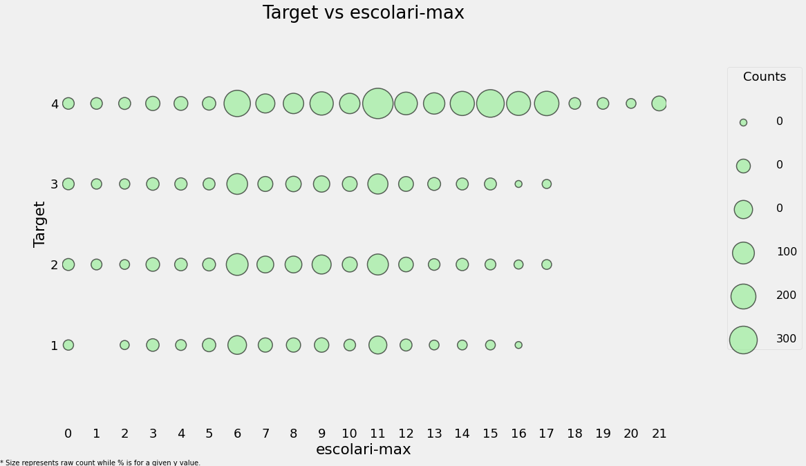
    


```python
plt.figure(figsize = (10, 6))
sns.violinplot(x = 'Target', y = 'escolari-max', data = final);
plt.title('Max Schooling by Target');
```


    
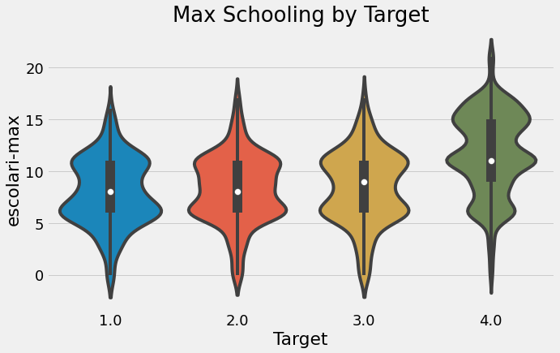
    


```python
plt.figure(figsize = (10, 6))
sns.boxplot(x = 'Target', y = 'escolari-max', data = final);
plt.title('Max Schooling by Target');
```


    
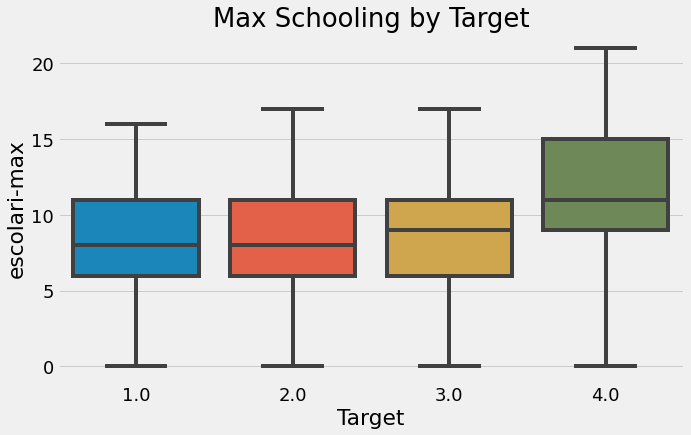
    


```python
plt.figure(figsize = (10, 6))
sns.boxplot(x = 'Target', y = 'meaneduc', data = final);
plt.xticks([0, 1, 2, 3], poverty_mapping.values())
plt.title('Average Schooling by Target');
```


    
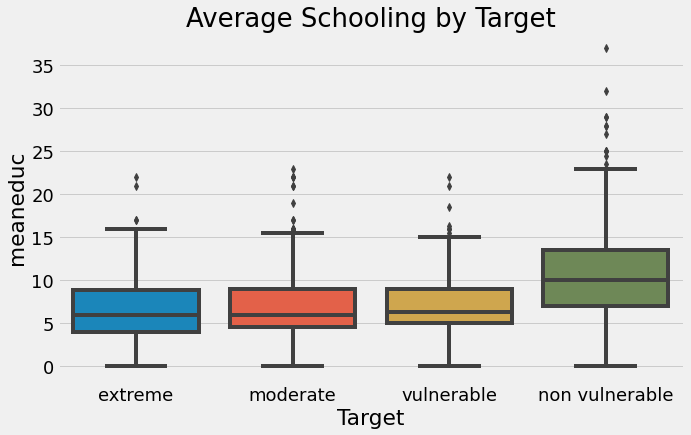
    


```python
plt.figure(figsize = (10, 6))
sns.boxplot(x = 'Target', y = 'overcrowding', data = final);
plt.xticks([0, 1, 2, 3], poverty_mapping.values())
plt.title('Overcrowding by Target');
```


    
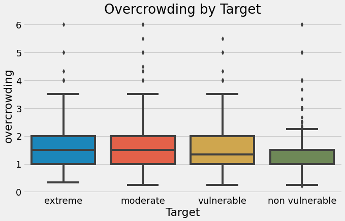
    


유용할 수 있는 또 다른 특징은 가장의 성별이다 -> 데이터를 취합했으므로 개별 데이터로 돌아가서 가장의 성별을 찾아보자


```python
head_gender = ind.loc[ind['parentesco1'] == 1, ['idhogar', 'female']]
final = final.merge(head_gender, on = 'idhogar', how = 'left').rename(columns = {'female': 'female-head'})
```


```python
final.groupby('female-head')['Target'].value_counts(normalize=True)
```


    female-head  Target
    0            4.0       0.682873
                 2.0       0.136464
                 3.0       0.123204
                 1.0       0.057459
    1            4.0       0.617369
                 2.0       0.167670
                 3.0       0.113500
                 1.0       0.101462
    Name: Target, dtype: float64


가장이 여성인 가정은 약간 더 심각한 수준의 빈곤을 가질 가능성이 있는 것으로 보인다.


```python
sns.violinplot(x = 'female-head', y = 'Target', data = final);
plt.title('Target by Female Head of Household');
```


    
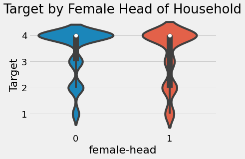
    


```python
# 성별에 따른 평균 교육의 차이 확인plt.figure(figsize = (8, 8))
sns.boxplot(x = 'Target', y = 'meaneduc', hue = 'female-head', data = final);
plt.title('Average Education by Target and Female Head of Household', size = 16);
```


    
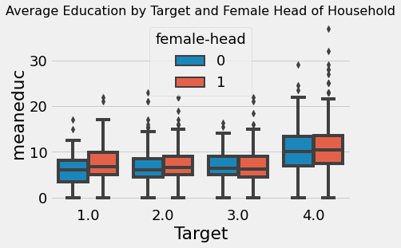
    


- 모든 타겟값을 살펴볼 때 여성 가장이 있는 가정은 교육 수준이 더 높은 것으로 보인다
- 전반적으로, 여성 가장이 있는 가정은 심각한 가난을 겪을 가능성이 더 높다


```python
final.groupby('female-head')['meaneduc'].agg(['mean', 'count'])
```


<div>
<style scoped>
    .dataframe tbody tr th:only-of-type {
        vertical-align: middle;
    }

    .dataframe tbody tr th {
        vertical-align: top;
    }

    .dataframe thead th {
        text-align: right;
    }
</style>
<table border="1" class="dataframe">
  <thead>
    <tr style="text-align: right;">
      <th></th>
      <th>mean</th>
      <th>count</th>
    </tr>
    <tr>
      <th>female-head</th>
      <th></th>
      <th></th>
    </tr>
  </thead>
  <tbody>
    <tr>
      <th>0</th>
      <td>8.968025</td>
      <td>6384</td>
    </tr>
    <tr>
      <th>1</th>
      <td>9.237013</td>
      <td>3903</td>
    </tr>
  </tbody>
</table>
</div>


전반적으로, 여성 가장이 있는 가구의 평균적인 교육은 남성 가장이 있는 가구보다 약간 더 높다.


```python

```
